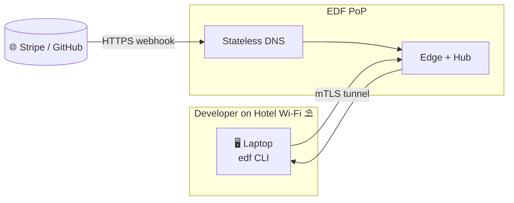

# 🖥️  UXPilot.ai – Brochure& Tech‑Blog Creative Brief (v0.1)

*(Target: marketing, design, and content teams. Audience: CTOs, Engineering Managers, DevOps leads.)*

---

## 1 ▪ Brand Positioning

**Tagline:**“Instant, Zero‑Trust Tunnels for Modern Dev & Edge Workloads.”

EDF is the **secure, open, self‑hostable** alternative to SaaS tunnels. Itcombines **ngrok’s developer UX** with **Tailscale‑grade security**, minus the lock‑in.

Messaging pillars ►

1. **Speed**– URL live in<2s (stateless DNS).
2. **Security**– mTLS, DNSSEC‑signed, 30‑min certs.
3. **Ownership**– 100% Rust, run anywhere, no black box.
4. **Enterprise Control**– OIDC, HMAC, rate limits, audit.

Tone: confident, forward‑looking, engineering‑centric but board‑safe.

---

## 2 ▪ Primary Brochure Page (Landing)

### 2.1 Wireframe outline

| Fold                  | Section                                                | Purpose                                                                                                       |          |
| --------------------- | ------------------------------------------------------ | ------------------------------------------------------------------------------------------------------------- | -------- |
| **Hero**              | Big headline + sub                                     | “Expose localhost in <2s. Signed & secure.”  CTA🔵*Start free*. Background: animated flow (code → globe). |          |
| **Problem**           | Pain bullets & competitor logos                        | Devs wait for 30s DNS, tunnels limited, or Tailscale needs extra proxy.                                      |          |
| **Solution**          | 3‑panel graphic (Hotel Wi‑Fi, CI Runner, Stripe)       | Visual shows stateless DNS + mTLS tunnel while client is behind NAT.                                          |          |
| **Feature grid**      | 4 icons (⚡ Speed, 🔒 Security, 📦 Ownership, 📈 Scale) | One‑liner each, deep‑link to docs.                                                                            |          |
| **Competitive table** | EDFvs.Ngrokvs.Tailscale (excerpt of matrix)        | Quick proof EDF wins on mTLS, DNSSEC, open‑source.                                                            |          |
| **Pricing teaser**    | Free / Team / Org cards                                | CTA “See all plans”.                                                                                          |          |
| **Social proof**      | Quote from retail POS pilot (“90% fewer outages”)     | Logo ticker for early adopters.                                                                               |          |
| **CTA**               | Code snippet (\`curl                                   | sh\`) + GitHub stars badge                                                                                    | Convert. |

### 2.2 Visual style

* Palette: **Electricblue** (#017bff) + Charcoal (#222) + Mint accent.
* Typeface:Inter (UI) + SourceCodePro (code).
* Subtle grid background, small parallax on hero.

### 2.3 UX notes

* Sticky header with Docs ↗, GitHub ↗, Pricing, Blog.
* “CopyURL” code blocks.
* Accessibility: contrast >4.5, `prefers‑reduced‑motion` fallback.

---

## 3 ▪ Blog / Insights Hub

### 3.1 Purpose

Drive organic traffic; establish technical authority; nurture leads via deep dives.

### 3.2 Categories & first five articles

| Category                  | Article concept                                                       | CTA path                         |
| ------------------------- | --------------------------------------------------------------------- | -------------------------------- |
| **Engineering Deep Dive** | “How we built zero‑copy DNS in Rust (1MQPS on one core)”            | Subscribe→ docs/perf‑benchmarks |
| **Security**              | “Why short‑lived certs beat revocation lists”                         | Pricing (enterprise)             |
| **Integrations**          | “Stripe webhook testing in CI with EDF + GitHub Actions”              | GitHub Marketplace ↗             |
| **Edge Stories**          | “From 300 stores to 1 button: replacing DIY SSH tunnels at FiscalPOS” | Case‑study PDF                   |
| **Dev Experience**        | “Ngrok vsTailscale vsEDF: hands‑on latency results”                 | Free sign‑up                     |

### 3.3 Layout

* Index: card grid, tag filter, estimated read time.
* Article page: Masthead image, GitHubgists embed, callout boxes.
* Sticky “TryEDF” sidebar.

### 3.4 SEO / Keywords

`webhook testing`, `mTLS tunnel`, `stateless DNS`, `Stripe localhost`, `open source ngrok alternative`, `rust dns server`.

---

## 4 ▪ Competitive talking points (copy snippets)

> **Ngrok is great for demos; EDF is built for pipelines.**  No 429s at 50kreq/min.
>
> **Tailscale secures internal traffic; EDF makes your *public* callbacks safe.**  No extra reverse‑proxy, no WireGuard config.

(Include in carousel or hover‑tooltips on landing.)

---

### 2.4 ▪ Quick visual – Developer‑in‑Hotel flow

*Lightweight visual emphasises outbound‑only tunnel and instant DNS reachability.*

---

## 7 ▪ Pricing plans

| Tier                   | Monthly | Concurrent tunnels | Call quota /‑day | TTL max | Auth modes                  | Support       |
| ---------------------- | ------- | ------------------ | ---------------- | ------- | --------------------------- | ------------- |
| **Free**               | €0      | 1                  | 25               | 30m    | Basic, HMAC                 | Community     |
| **Team**               | €49     | 10                 | 250              | 2h     | Basic, OIDC, HMAC           | 8×5 email     |
| **Org**                | €199    | 50                 | 1000            | 12h    | Basic, OIDC, IP allow, HMAC | 24×5 priority |
| **EnterpriseOn‑prem** | Custom  | Unlimited          | Custom           | Custom  | SSO, SCIM, mTLS per tenant  | 24×7 SLA      |

> **Self‑hosting** is available *only* under an Enterprise contract. Managed cloud plans run on EDF’s PoPs with global SLA.

---

## 5 ▪ Content production checklist

* [ ] Brand copy deck approved.
* [ ] Hero SVG animation delivered.
* [ ] Competitive table coded responsive.
* [ ] BlogCMS (Markdown + Astro) scaffolded.
* [ ] First 3 articles drafted & scheduled.

---

## 6 ▪ Timeline

1. **Week0‑1**– Wireframes + brand pack. 2. **Week2‑3**– Build hero, pricing component, blog skeleton. 3. **Week4**– Populate copy, integrate analytics, SEO pass. 4. **Week5**– Launch + announce on HackerNews, Dev.to.

---
---

© 2025 Ephemeral DNS Forwarder – Marketing brief
