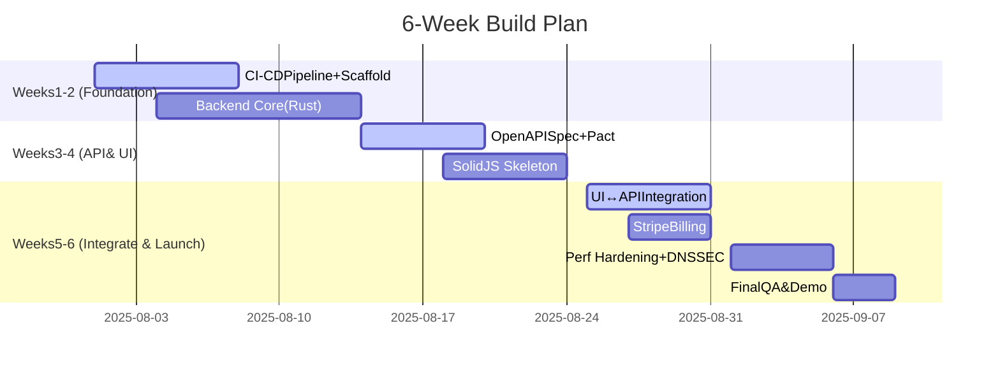

# **🚀 Hackathon Pitch: Build FleetingDNS in 6 Weeks**

*(12‑slide outline – ready for GoogleSlides / Keynote)*

---

## Slide1—Title

**“Ship a Zero‑Trust Tunnel Platform in SixWeeks”**
Hackathon team:\_\_\_\_\_\_\_\_\_\_\_\_\_\_
Sprint window: **6×7‑day iterations**
Outcome: Public beta + live demo.

---

## Slide2—Vision& Scope

*Instant, secure tunnels for webhooks & OAuth.*
Competes with ngrok / Tailscale, written in pureRust.
MVP tracks: **CI‑CD, backend, OpenAPI, Pact, SolidJS UI, Stripe billing**.

---

## Slide3—6‑Week Macro Timeline

---

## Slide4—SettingupCI‑CD (Week1)

**Tools:** GitHubActions, Cargo cache, DockerBuildx
Pipeline stages:

1. Lint+ unit‑test on every push.
2. Build Rust binaries → multi‑arch image.
3. Auto‑publish `edge‑hub` container to GHCR.
4. Preview deploy to K3d for PRs.

Deliverable: staging PoP spins up in <10min per commit.

---

## Slide5—Building the Backend (Weeks1‑2)

* Crates: `tokio`, `rustls`, `trust‑dns`, `rcgen`, `redis‑rs`.
* Modules:

    * `tunnel_hub` — SSH reverse proxy.
    * `stateless_dns` — HMAC label authority.
    * `ca_service` — 30‑min Ed25519 cert signer.
* Expose Prom metrics.

Deliverable: hub accepts mTLS tunnel & echoes HTTP.

---

## Slide6—BackendAPIwithOpenAPI (Week3)

* YAML v3.1 spec in Stoplight.
* Endpoints: `/v1/tunnels`, `/v1/tokens`, `/v1/billing`.
* Auto‑generate **TypeScript + Rust stubs** via `oapi‑codegen`.

Deliverable: `/docs` Swagger UI served by axum.

---

## Slide7—Pact Contracts (API⇄Clients) (Week3)

* `pact‑rs` provider; `@pact‑foundation/pact` consumer.
* CI verifies provider on every PR.
* Contracts stored in PactFlow cloud.

Benefit: UI & SDKs stub API without backend.

---

## Slide8—Front‑end inSolidJS (Week4)

* Vite + SolidStart.
* Tailwind + shadcn/ui for components.
* Pages: Dashboard, CreateTunnel, Billing.

Deliverable: responsive SPA hitting mock API.

---

## Slide9—Integrate UI↔Backend (Week5)

* Generate Zod types from OpenAPI.
* Solid‑Query hooks cache calls.
* Feature flag for staging vs prod base URL.

Goal: create tunnel from UI, see FQDN instantly.

---

## Slide10—Pact Tests for Front‑end (Week5)

* Run consumer Pact in CI.
* Provider verifies contract post‑merge.
* Smoke test: Docker‑compose full stack & replay Stripe webhook.

---

## Slide11—Stripe Billing Integration (Week6)

* Stripe Checkout + webhooks.
* Plans: Free, Team, Org.
* `invoice.paid` event updates quotas.
* UI Billing page shows plan + usage.

Deliverable: sandbox checkout triggers DB update.

---

## Slide12—Perf Hardening & Launch (Week6)

* Zero‑copy DNS encode (E1e) & flamegraph pass.
* DNSSEC signing (E1c) enabled.
* Final demo: GitHubAction ➜ Stripe test webhook ➜ local dev app.

**Stretch goals:** Helm chart, multi‑cluster slot sharding (E1f).

*“Six weeks. One team. A production‑ready, secure tunnel platform.”*
