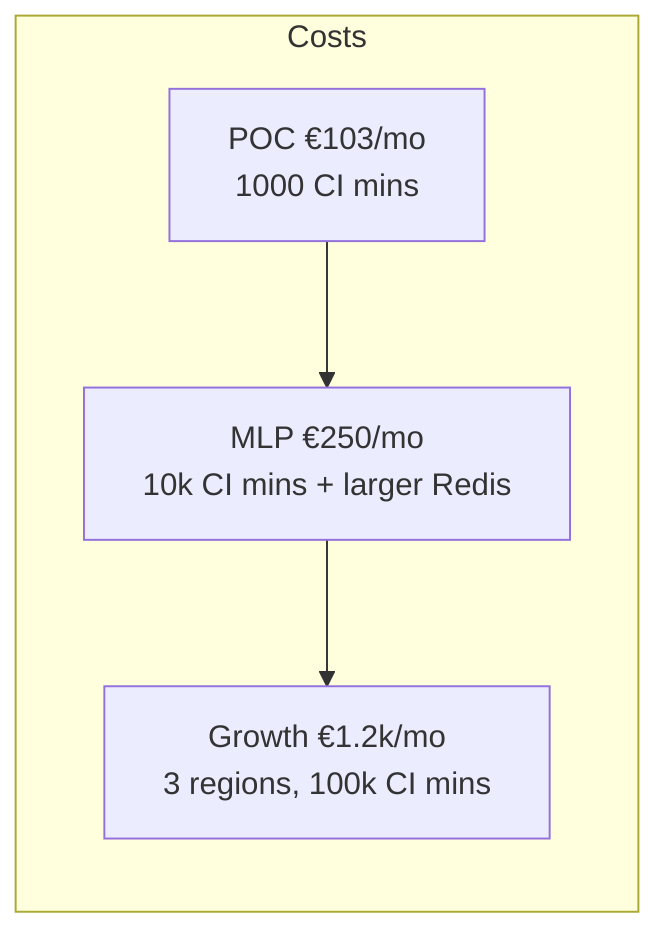

# 🚀 Hackathon Pitch – 6‑Week Build **(+ Infra Excellence)**

*14‑slide outline – ready for Google Slides*

---

## Slide1— Title

**“Ship the Secure Tunnel Platform — and the Infra to Scale It”**
Hackathon team• 6‑week sprint
Outcome: MVP + world‑class infra demo.

---

## Slide2— Vision Recap

*Instant, zero‑trust tunnels for webhooks & edge devices.*
Now fortified with **cloud‑native infra best‑practice** from day1.

---

## Slide3— Why Infra Matters for Start‑ups

* "Broken infra debt" kills demos and investor confidence.
* 40% of seed burn is unplanned ops fire‑fighting (Snyk2024).
* **We showcase that a 3‑person team can run prod‑grade infra <€110/mo.**

---

## Slide4— Infra Highlights (2025 stack)

| Layer        | Tech                                      | Win                                 |
| ------------ | ----------------------------------------- | ----------------------------------- |
| CI compute   | **actions‑runner‑controller on GKE Spot** | Pay‑per‑minute; no idle VM.         |
| Provisioning | **Crossplane + Flux**                     | GitOps, no click‑ops.               |
| Security     | Workload Identity Federation              | **Zero SA keys**; OIDC tokens only. |
| Cost guard   | GCP Budgets + Spot pools                  | Auto scale0→N; alerts at 50%.   |

---

## Slide5— Financial Snapshot (POC → Growth)

*We defer 90% of infra spend until we have paying users.*

---

## Slide6— Build Timeline (unchanged dev weeks)

*(reuse Week1‑6 Gantt)*

---

## Slide7— **Day0 Bootstrap Demo**

Spot VM → k3s + Flux → Crossplane → infra cluster → self‑destruct.
Live in <15min. Show cost line **€0.02**.

---

## Slide8— Progressive Delivery with Flagger

* Canary 1% → 50% in 2min if p95<200ms & <2%5xx.
* Auto‑rollback keeps tunnel SLA.

---

## Slide9— Multi‑Cluster Readiness

One YAML toggle adds us‑central1 + ap‑southeast1 via NEG; cost grows linearly only when revenue justifies.

---

## Slide10— Cost Comparison vs Legacy VM Runner

| Approach        | Idle €/mo | 1k CI min | 10k CI min |
| --------------- | --------- | --------- | ---------- |
| Hetzner CX11    | **49**    | 49        | 49         |
| GKE Spot runner | 0         | **≈5**   | **≈48**   |

> Break‑even at \~10kCI minutes.

---

## Slide11— Story for Investors & Buyers

* "Our infra ROI scales *after* revenue, not before."
* Enterprise buyers see SLSA + OPA + no keys → trust from day 1.
* Easier due‑diligence → faster deals.

---

## Slide12— Demo Drive Plan

1. Push PR → runner pod spins, compile in 35s.
2. Stripe test webhook hits new tunnel (latency chart).
3. Flagger flips 50% → 100% on success.
4. Cost dashboard shows €0.003 burn.

---

## Slide13— The Call to Action

We aren’t just building a product; **we’re proving infra maturity on a shoestring.**
Join the sprint, own a slice of the future tunnel stack.

---

## Slide14— Appendix: XR & Helm inventory

(Table of 31 manifests – reference E0a)
Stakeholders can audit every object pre‑hackathon.

---

©2025 EDF Hackathon Pitch Deck v0.3
