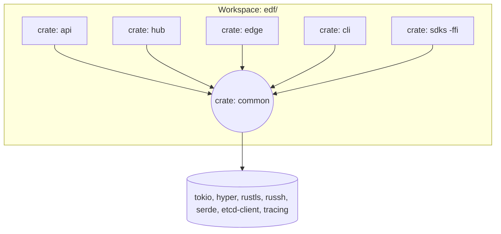
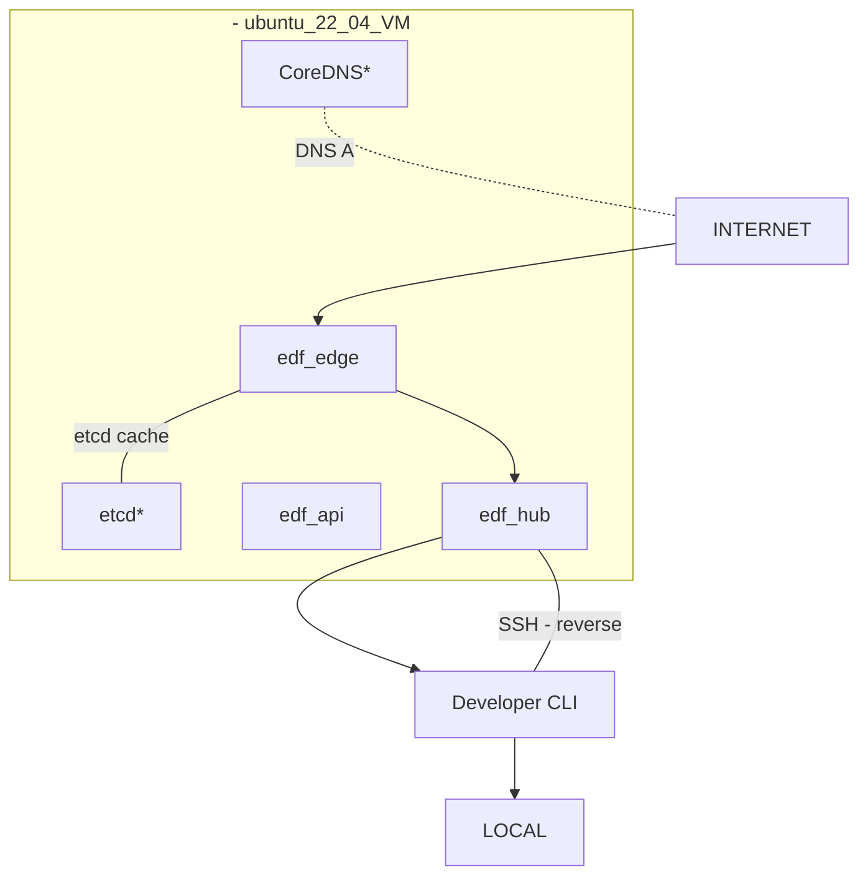
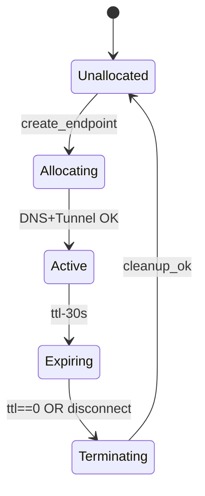
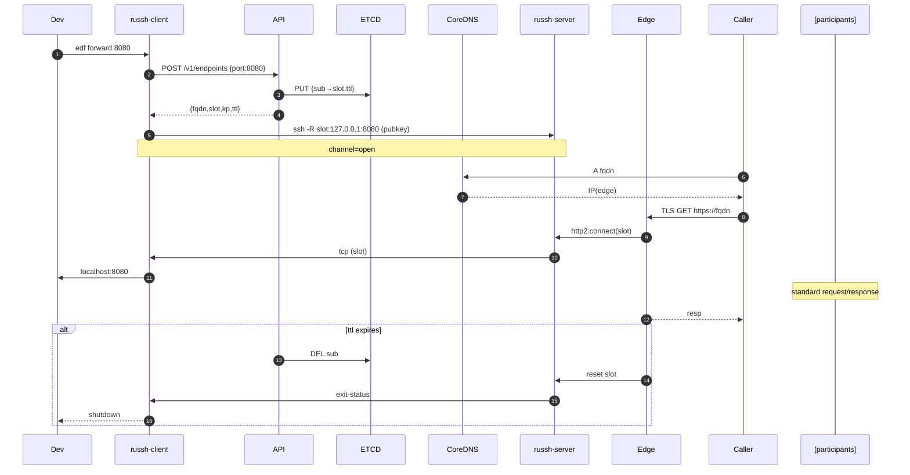

# FleetingDNS – **Product Requirements Document (v1.1)**

*Last updated: 2025‑07‑02*

> **NOTE** –This revision deepens the design and constrains all first‑party runtime code to **pureRust**.  The only non‑Rust executables in the final system are **CoreDNS** (authoritative DNS) and **etcd** (dynamic record store).  Everything else—edge proxy, tunnel server, CLI/SDK, control plane API—is delivered as Rust binaries we own and maintain.

---

## 1Vision & Purpose

FleetingDNS (FDF) turns any developer workstation or CI job into a publicly addressable host **in one command** while remaining **temporary, secure, and zero‑config**.  It eliminates the friction of testing webhooks, OAuth callbacks, ACME flows, or multi‑tenant host‑based routing by creating a *30‑minute* DNS entry and a reverse tunnel that streams traffic back to the local service.  After TTL expiry or tunnel drop, all artefacts self‑destruct, leaving zero footprint.

FDF is expressly **DX‑first** and **Rust‑native**.

---

## 2Problem Statement (Expanded)

1. **External callback pain**– OAuth providers, Stripe/Twilio webhooks, and ACME challenge endpoints require a *stable, publicly resolvable* URL during testing.  Localhost isn’t enough, and manual DNS entries + port‑forwarding take minutes and distract developers.
2. **Multi‑tenant routing gaps**– Modern SaaS apps route by `Host:` header.  QA and automated tests need distinct sub‑domains per tenant instance to replicate production behavior.
3. **Security & cleanup risk**– DIY tunnels (SSH `-R`, inlets, ngrok free tier) leave forgotten ports, indefinite DNS records, or unpredictable URLs.  They are either insecure (self‑signed certs) or costly (paid static URLs).

FDF solves the above with *on‑demand, short‑lived, strongly‑scoped* DNS+tunnel instances that require **no manual infra changes**.

---

## 3Solution Overview (Rust‑Centric)

### Runtime Components  (all Rust except noted \*)

| Component                     | Binary / Crate            | Language                                       | Responsibility                                                                 |
| ----------------------------- | ------------------------- | ---------------------------------------------- | ------------------------------------------------------------------------------ |
| **Control‑Plane API**         | `edf‑api`                 | Rust (axum)                                    | Auth, endpoint lifecycle, quota, billing hooks(Stripe)                        |
| **Tunnel Hub / Multiplexer**  | `edf‑hub`                 | Rust (tokio, russh)                            | Accept reverse‑tunnel sessions; multiplex TCP & HTTP2 streams to local clients |
| **Edge Router / TLS Offload** | `edf‑edge`                | Rust (hyper + rustls)                          | Terminate wildcard TLS, route by SNI ↔ tunnel, optional HTTP302 redirect mode |
| **Local CLI / Daemon**        | `edf`                     | Rust (clap, tokio)                             | Request endpoint, start russh client, bridge local <→ hub                      |
| **SDKs**                      | `edf‑client‑{py,js,go}`   | Rust (compiled to WASM for JS) & idiomatic FFI | Wrap CLI via gRPC control socket; expose high‑level helpers                    |
| **Authoritative DNS**\*       | **CoreDNS** + etcd plugin | Go                                             | Serve`*.edf.run` with 60s TTL records                                        |
| **Dynamic Store**\*           | **etcd**                  | Go                                             | Holds `{subdomain → hub‑slot}` mappings & expiry metadata                      |

> **Why no NGINX/OpenSSH?**We embed **russh** (pure‑Rust SSH) for both client and server ends, giving full control of auth and multiplexing.  Edge router uses **rustls**; no OpenSSL.

### End‑to‑End Call‑Flow (text)

1. **CLI** (`edf forward 8080`) → `POST /v1/endpoints` → **API**
2. **API** writes `/dns/{uuid}` = `{hub_slot}` (TTL & user‑id) into **etcd**; returns `{fqdn, hub_slot, ttl, ssh_key}`.
3. **CLI** spawns **russh client** – opens an SSH reverse‑port `0.0.0.0:hub_slot` on **hub**.
4. **CoreDNS** now returns A/AAAA of **edge** for `fqdn`.
5. External caller hits `https://fqdn`; **edge** terminates TLS via wildcard cert; looks up `{hub_slot}` from in‑mem cache → streams bytes via upgraded HTTP2 channel to **hub** → **russh** → developer’s port8080.
6. After `ttl` or tunnel disconnect, **API GC** deletes etcd key; **edge** stops routing; **hub** closes channel; **CLI** exits.

A detailed Mermaid sequence is retained in §8.3.

---

## 4Goals & Success Metrics (Revised)

| Goal                      | Metric                                               | Target              |
| ------------------------- | ---------------------------------------------------- | ------------------- |
| **Ultra‑fast provision**  | `p50 create_endpoint` ≤1s                          | 0.8s               |
| **Rust‑native footprint** | 0 non‑Rust runtime deps (excl. CoreDNS/etcd)         | Achieved            |
| **Tunnel reliability**    | <0.1% unexpected disconnects / hour @1000 tunnels | ≤0.05%            |
| **Paid conversion**       | MRR €5000 by month12                               | 5% of active users |

---

## 5Detailed Functional Requirements

### 5.1Control API (REST + gRPC)

| Verb     | Path                 | Auth         | Description                       |                                                                     |
| -------- | -------------------- | ------------ | --------------------------------- | ------------------------------------------------------------------- |
| `POST`   | `/v1/endpoints`      | Bearer (JWT) | Body: \`{port, ttl, mode:\[tunnel | redirect], redirect\_url?}`→ 201`{id,fqdn,ttl,hub\_slot,ssh\_key}\` |
| `DELETE` | `/v1/endpoints/{id}` | Bearer       | Early teardown                    |                                                                     |
| `GET`    | `/v1/endpoints/{id}` | Bearer       | Status heartbeat                  |                                                                     |

### 5.2Tunnel Protocol

* **Transport**: SSHv2 (russh) over TLS‑wrapped TCP (optional)
* **Auth**: Ed25519 key‑pair issued per endpoint (single use)
* **Channel**: `direct-tcpip` reverse‑forward for port`hub_slot`
* **Keep‑alive**: 15s `SSH_MSG_GLOBAL_REQUEST keepalive@edf`
* **Graceful close**: `exit-status 0` – CLI waits 1s then exits.

### 5.3Edge Routing Logic

```text
on_accept(conn):
  sni = parse_sni(conn.tls);
  slot = cache.get(sni) | etcd.lookup(sni)
  if !slot:  return 404
  if mode == redirect:
      send_302(redirect_url)
  else:
      open_http2_stream(slot)  # to hub
      proxy(conn <-> stream)
```

---

## 6Non‑Functional Requirements (Expanded)

* **Concurrency**: 10000 simultaneous TCP flows via tokiomio without thread‑per‑conn.
* **Cross‑platform**: Binaries for x86‑64&ARM64 Linux/macOS/Windows via rust‑cross.
* **Observability**: OpenTelemetry tracing to Prometheus; histogram buckets for important latency paths; structured JSON logs.
* **Security Hardening**:
  – rustls strict cipher‑suite (TLS1.3 only)
  – ssh `pubkey` + short‑lived JWT must both match (defense in depth)
  – Edge rate‑limits new TLS handshakes per IP.

---

## 7Software Architecture (Rust Crate Decomposition)



* **`common`** – shared models, error types, etcd wrapper, tracing utils.
* **`api`** – axum / tower‑layer auth middleware, Stripe webhooks handler, rate‑limit.
* **`hub`** – russh server implementation + HTTP2 control plane to `edge`.
* **`edge`** – hyper TLS listener, SNI routing, optional 302 redirect.
* **`cli`** – clap, russh client, local port forwarder, auto‑update.
* **`sdks`** – Minimal FFI wrappers generated via cbindgen (Go), pyo3 (Python), wasm‑bindgen (JS).

---

## 8Diagrams

### 8.1High‑Level Deployment (Hetzner MVP)



### 8.2State Diagram – Endpoint Lifecycle



### 8.3Sequence (Detailed)



---

## 9Detailed Epics & Milestones

| Phase  | Epic                        | Stories                                                             | Owner(crate)  | Est. |
| ------ | --------------------------- | ------------------------------------------------------------------- | -------------- | ---- |
| **0**  | *Workspace Bootstrap*       | Cargo workspace, set up CI (GitHub), rustfmt, clippy, cross builds  | all            | 2d  |
| **1**  | *Dynamic DNS*               | integrate etcd client, write CoreDNS config plugin, `/dns/*` schema | `common`,`api` | 3d  |
| **2**  | *Tunnel Hub (russh server)* | spawn russh, map reverseport→stream, keepalive                     | `hub`          | 7d  |
| **3**  | *Edge Router*               | TLS w/ rustls, SNI map, http2 framing, basic metrics                | `edge`         | 6d  |
| **4**  | *CLI MVP*                   | token handshake, russh client, local port forward, interactive UX   | `cli`          | 5d  |
| **5**  | *Happy‑Path E2E*            | connect CLI ↔ hub ↔ edge, serve static HTML                         | all            | 3d  |
| **6**  | *TTL & GC*                  | scheduler, etcd leases, CLI shutdown signals                        | `api`,`hub`    | 4d  |
| **7**  | *SDKs & CI Sample*          | Python wheel via pyo3, GH Action, jest fixture                      | `sdks`         | 5d  |
| **8**  | *Security Hardening*        | ed25519 keys, JWT auth, rate‑limit, basic‑auth header               | `api`,`edge`   | 5d  |
| **9**  | *Billing Alpha*             | Stripe price ids, webhook subscriptions                             | `api`          | 3d  |
| **10** | **MVP Launch**              | Docs, Docker Compose, Hetzner deploy script                         | all            | --   |

---

## 10Risk Register (Extended)

| ID | Risk                     | Impact                   | Likelihood | Mitigation                                                                   |
| -- | ------------------------ | ------------------------ | ---------- | ---------------------------------------------------------------------------- |
| R1 | russh library immaturity | Tunnel instability       | M          | Fork & harden, extensive integration tests                                   |
| R2 | Edge DoS attack          | Downtime / cost          | M          | IP & TLS rate limiting (tokio‑rlimit), Cloudflare in front optional          |
| R3 | Domain/SSL mis‑issuance  | Service outage           | L          | ACME auto‑renew cron, secondary wildcard cert backup                         |
| R4 | Single PoP               | 30min blackout on crash | M          | Systemd auto‑restart, daily snapshot backup, plan multi‑region PoP after MVP |

---

## 11Appendix

* **Crate Policy:** MSRV1.79, edition2024, denywarnings.
* **Binary Targets:** `edf-api`, `edf-edge`, `edf-hub`, `edf-cli`.
* **Ports:** 443 (TLS), 22 (SSH optional), range60000‑65000 for hub slots.
* **Third‑Party Crates:** `tokio`, `hyper`, `rustls`, `russh`, `serde`, `tower`, `clap`, `etcd-client`, `opentelemetry`, `tracing`.
* **Open Questions:** custom domain support timeline, mTLS handshake spec, Windows service install for CLI.

---

©2025 FleetingDNS — internal use only
