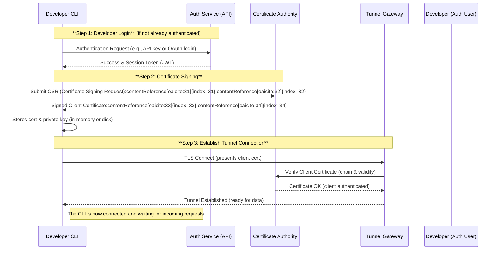
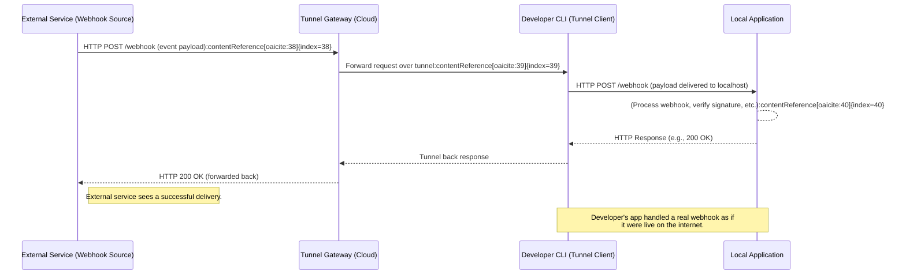
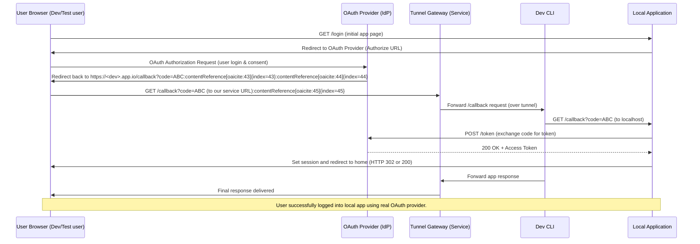

# Secure Reverse Tunneling and Webhook Testing Service – White Paper

## Introduction

Modern development teams frequently face challenges when integrating external services and authentication flows into their applications. Key among these challenges are **receiving webhooks in local environments, testing OAuth-based logins, and securely exposing development environments for collaboration or external access**. Traditionally, developers resort to workarounds like polling for events or deploying to staging environments early, which are inefficient. They might use tools like ngrok or manually set up SSH tunnels to expose `localhost` to the internet for testing – but these approaches can introduce security concerns if not handled properly. In short, the developer’s local environment, often thought of as “isolated”, increasingly needs controlled exposure to the outside world for tasks like webhook reception and single sign-on (SSO) flows.

This white paper introduces a **secure reverse tunneling service** designed to solve these problems in a unified way. From a **product perspective**, we will illustrate how the service improves developer productivity and streamlines testing of webhooks and authentication. From a **security perspective**, we will delve into how the service is built with robust measures – including mutual TLS, short-lived certificates, and access controls – to mitigate risks when exposing local services. We will discuss the service’s webhook handling design, its approach to simplifying OAuth callbacks for local testing, and the public key infrastructure (PKI) that underpins the secure tunnels. We will also compare this solution with alternative approaches and highlight how it addresses both functionality and security in a balanced manner.

By the end of this paper, engineers, CTOs, and security professionals will have a comprehensive understanding of the service’s architecture, the problems it solves, and the security implications of its design. This document serves as a foundational guide for building and using the service, ensuring that development teams can test integrations with confidence and without compromising on security.

## Challenges in Development and Testing Environments

Developers commonly encounter a few pain points when trying to integrate external systems or security mechanisms in a local development setting. We outline the major challenges below, which our service aims to address:

### Webhook Integration Testing on Localhost

Webhooks are a prevalent mechanism for one service to send real-time notifications to another. However, testing webhook-consuming code in a local environment is notoriously difficult because **external services cannot reach `localhost` by default**. Normally, a webhook provider (e.g. a payment gateway, GitHub, etc.) needs a public URL to deliver its HTTP requests. Developers lacking an accessible URL often resort to either deploying code to a test server prematurely or using dummy data. This is problematic because it’s **critical to test real webhook flows and payloads early** – webhooks can silently fail or misbehave if not handled correctly.

Several tools have emerged to help expose local endpoints. The most common solution is to use an **HTTP tunneling service** that provides a public URL and forwards incoming requests to the developer’s machine. For example, **ngrok** and **Cloudflare Tunnel** are popular choices; they create an **encrypted tunnel** from an external endpoint to a local port. This allows the external webhook provider to call into `localhost` as if it were publicly available. Without such a tunnel, “your webhook sender won't be able to convey its payload to your development machine” at all.

**Problems faced without a good solution:** Developers struggle with unreliable or manual testing of webhooks. They might use services like requestbin to capture payloads and then copy them into local tests, or they might open a temporary port forward which could expose their system (more on security issues later). These approaches are cumbersome and error-prone. Essentially, the lack of a secure, convenient way to receive real webhooks on localhost can slow down development and leave edge cases untested.

### Authentication and OAuth Flow Testing

Apart from webhooks, modern apps often integrate with third-party identity providers (Google, Facebook, Okta, etc.) or implement OAuth 2.0 flows. **Testing OAuth or SSO flows in a local environment introduces its own challenges.** Many OAuth providers enforce security restrictions on redirect URIs – for instance, Google, Slack and others disallow redirecting to plain `http://localhost` or require an HTTPS URL. Developers frequently find that *“the API you’re trying to run OAuth for doesn’t allow you to redirect HTTP URLs, not even on localhost”*. Some providers outright forbid using `localhost` in redirect URLs or demand that the domain be verifiable or on a public top-level domain.

This means a developer building an “Login with Google” feature cannot simply use `http://localhost:3000/callback` in their OAuth client configuration, as Google will reject it in many cases. The typical workarounds include: setting up a fake domain with HTTPS that maps to localhost (which can be complex to do with self-signed certs), using a hosted staging environment for testing (slower iteration), or employing a tunneling service. Tunneling is often the simplest – e.g. using an external HTTPS address that forwards to localhost allows compliance with providers’ requirements for HTTPS and public domain. Indeed, using a tunnel like ngrok for OAuth callbacks is a recommended practice to *“get an external HTTPS URL that forwards the traffic to localhost”*.

**Problems without a solution:** Developers end up **unable to fully test authentication flows** locally, or they might compromise on security by disabling checks. For instance, they might remove HTTPS requirements or use dummy credentials in dev. This is risky because it diverges from production behavior. It also can be dangerous if an OAuth flow is partially tested; for example, misconfiguring the callback handling can lead to vulnerabilities or errors only discovered later. Additionally, testing flows like Sign-In with Apple or other strict providers requires a real domain – developers have documented workarounds to “trick” such flows for local testing, but these are often hacky. Clearly, a straightforward way to test OAuth and other login integrations locally (with real redirects and tokens) is needed.

### Securing Exposed Development Endpoints

When developers do expose their local server to the internet (via a tunnel or other means), **security concerns arise**. A local dev environment is usually not hardened like a production server – it may run with debug configurations, sample data, or less stringent access control. **Opening it up without protection can be dangerous**. There are a few aspects to this problem:

* **Lack of Authentication on the Tunnel:** If you make your local web app reachable on a public URL, anyone who discovers that URL could potentially access it. Many developers have shared cautionary tales of forgetting an ngrok session open and finding unexpected requests. If the dev app itself doesn’t require login (maybe because in dev mode they bypass it), this could leak data or allow unintended actions. It’s *“overlooking the significant risk of lacking authentication and encryption”* on an exposed dev service.

* **Weak or Reused Credentials:** Even if the app has login, often test credentials are weak (e.g. a common “test/test” username-password used by all developers). Attackers could brute force or reuse known default passwords if the service is reachable. As one security article notes, dev environments often have *“weak permissions or poor/reused credentials”* and are a tempting target.

* **Data Privacy and Leaks:** The dev environment might contain sample datasets that include real-ish data, or it might log verbose information. An exposed endpoint could leak sensitive info. For example, if testing a webhook that carries a secret or user info, having that go over an insecure channel or to an unauthorized person is a risk.

* **Man-in-the-Middle and Encryption:** By default, exposing `localhost` via a tunnel should use encryption, but if a developer sets up something like a raw TCP forward or a custom solution, they might inadvertently transmit data in plaintext. The Medium article *“Don’t Let Your Test Environment Become the Next Data Leak”* highlights that if any local port is exposed and you use HTTP, *“this plaintext transmission of user credentials or personal data could be intercepted”*. Encryption is paramount, even in testing.

In summary, **the challenge is to expose local services for testing in a way that is secure by design**. Developers need an easy means to restrict access (e.g., via a simple authentication layer on the tunnel) and to ensure all traffic is encrypted. They should also have confidence that using the tool won’t inadvertently reveal their IP address or open a door to attackers. Traditional solutions have started addressing this (for instance, ngrok allows setting a basic auth on tunnels, but only on certain plans; Cloudflare Tunnel integrates with Cloudflare Access for SSO gating). However, many developers either skip these steps due to complexity or cost, or are unaware of the risk. A good solution should make secure defaults (like enforced TLS and optional access control) a built-in feature, not an afterthought.

## Solution Overview: Secure Webhook and OAuth Tunneling Service

Our proposed service is a **unified platform that provides secure reverse tunneling, webhook relay, and authentication support for development environments**. In essence, it gives each developer a safe public endpoint for their local application, with integrated features to solve the challenges described. Key features and problems solved include:

* **Secure Reverse Tunnel:** The core is a reverse tunneling mechanism that creates an outbound connection from the developer’s machine to our cloud service. This tunnel carries inbound traffic (webhooks, OAuth callbacks, etc.) back to the developer’s local server. Because it’s outbound-only, **no inbound ports need to be opened on the developer’s network**, and the local machine remains behind its firewall/NAT. This drastically reduces attack surface compared to port forwarding.

* **PKI-Based Authentication:** Unlike simple token-based tunnels, our service uses a Public Key Infrastructure to authenticate tunnel clients. Each client (CLI) obtains a short-lived certificate from our certificate authority (CA) and uses mutual TLS (mTLS) to establish the tunnel. This ensures that **only authorized clients (developers) can connect**, and the server positively identifies them via certs, mitigating impersonation. The use of **short-lived certificates** (ephemeral certs) means that even if credentials are compromised, they quickly expire, eliminating the need for complex revocation management.

* **Webhook Ingress and Developer Experience:** The service provides a stable **public URL (or set of URLs)** that developers can use to register webhooks. When external services send events to these URLs, our cloud service receives them and forwards them in real-time to the developer’s local app through the tunnel. This solves the local webhook testing problem by effectively making the developer’s machine a first-class endpoint on the internet, but **without exposing its identity or requiring manual setup**. Additionally, the service can log and display webhook payloads and responses for debugging (similar to how ngrok’s inspector works) to make troubleshooting easier. Developers can replay deliveries with one click, avoiding the need to trigger external events repeatedly during testing.

* **OAuth Callback Handling:** For OAuth and SSO flows, developers can use the provided public URL as the redirect URI in their OAuth client registrations. Our service will handle the browser redirect from the third-party provider back to the local app. Crucially, the provided URL will be HTTPS (with a valid certificate) which satisfies providers’ requirements for security. The secret authorization codes or tokens delivered via redirects are thus protected in transit over TLS. By enabling this, we solve the “localhost OAuth” issue – no more editing hosts files or deploying just to test login. Developers get to run the full auth flow locally, exactly as it would happen in production, giving them confidence that things like callback processing and token exchange are implemented correctly.

* **Built-in Access Controls for Exposed Services:** Our service allows (or even defaults) the use of authentication on the publicly exposed URLs. For instance, a developer can require HTTP Basic Auth (username/password) or integrate with an OAuth2 proxy such that anyone trying to access the dev URL must log in (could integrate with the team’s IdP for single sign-on). Even a simple Basic Auth adds a layer of protection – **only those with the credentials can access the temporary site**. This prevents casual scanning or unintended public access to a developer’s work-in-progress. From a product standpoint, this is solving the “I want to show my local site to a teammate or test user, but I don’t want it open to the whole world” problem. From a security standpoint, it enforces that exposing a service for testing doesn’t mean compromising on authentication.

* **Username/Account Testing Support:** The service also addresses the “username authentication problems” for developers in another way: by simplifying the creation of test user accounts or sessions. For example, if a developer wants to test with multiple user roles, the service could provide CLI commands or UI tools to generate magic login links or temporary users in the dev environment. This would integrate with the tunneling in that a tester could visit the tunneled URL and automatically be logged in as a predefined test user (perhaps via a query token or a stub IdP the service runs for dev purposes). While the implementation can vary, the core idea is to eliminate the friction of creating and managing dummy accounts for testing authentication. Instead, developers can focus on scenarios (admin vs regular user, expired credentials, etc.) and quickly switch contexts. This addresses the often neglected problem where devs share a single admin login for testing, which doesn’t simulate real-world differences in user roles or states.

* **Extensibility and Team Collaboration:** From a product perspective, our service is designed to work for individual developers as well as teams. Each developer can have their own isolated tunnel and endpoints. For team use, we envision features like shared dashboards of recent webhooks, the ability for one dev to hand off a tunnel to another (persistent named URLs for a project), or to have multiple developers’ services behind different paths of one domain. The service will manage routing and security in all cases. This reduces duplicated effort – for example, a QA engineer could use the same tunnel URL to test a feature without setting up anything, if the developer has it running, but they would still need the credentials if access is restricted.

In the following sections, we will dive deeper into the architecture and security design of this solution. We’ll illustrate how the reverse tunnel is established via our PKI infrastructure, detail the webhook delivery flow, explain the OAuth use-case step by step, and discuss the security implications (benefits and considerations) of this design.

## System Architecture and Components

To understand how the service operates, let’s break down the architecture into its main components and the data flow between them. At a high level, the system consists of:

* **Client-side CLI (Agent):** A command-line tool that the developer runs on their local machine. This CLI is responsible for initiating the tunnel connection to the cloud service, handling incoming traffic (forwarding it to the local app), and managing authentication (obtaining certificates, etc.). It runs as a background process while the tunnel is active.

* **Cloud Service Backend:** This includes several sub-components:

    * **Tunnel Server/Gateway:** A server (or a cluster of servers) that terminates incoming connections from external systems and forwards them through the tunnels to the clients. It effectively acts as a **reverse proxy**, holding a public endpoint and mapping it to an active client tunnel.
    * **Authentication and PKI Service:** Responsible for verifying developer identity (when starting a tunnel) and issuing the short-lived certificates. This may involve an API and a Certificate Authority (CA). The CA issues client certificates that the tunnel server will trust. This component also interfaces with our user account system or OAuth if the developer logs in with third-party credentials.
    * **Webhook Handler/Router:** (This might be part of the Tunnel Server or a layer above it.) It knows how to route incoming HTTP requests to the correct client based on the URL or domain. It may also log requests and provide an interface for viewing them. In some designs, this could be as simple as the Tunnel Server itself parsing the domain to find the right tunnel. In others, a separate service might hold routing info, especially if we allow custom subdomains or advanced features.
    * **Web Interface & Developer Dashboard:** Optionally, a web UI where developers can inspect traffic (webhook payloads, etc.), manage settings, and so on. This isn’t strictly necessary for functionality (the CLI could output logs too), but is a useful component for user experience.

* **External Services:** These are not part of our system but are the systems interacting with it, such as:

    * Webhook sources (e.g., Stripe, GitHub) that will send HTTP requests to the service’s provided URLs.
    * OAuth providers or identity providers that will redirect users to our service’s URL as part of login flows.
    * End-users or testers who might access the developer’s exposed app via the public URL (in a demo or testing scenario).

Below is a diagram depicting the core architecture and interactions between these components:

```mermaid
flowchart LR
    subgraph Developer_Machine["Developer Machine"]
        CLI[Developer CLI Agent]
        App[Local Application<br/>(e.g., web server)]
    end
    subgraph Cloud_Service["Cloud Service"]
        Gateway[Tunnel Gateway<br/>(Reverse Proxy)]
        AuthCA[Auth & CA Service<br/>(Certificate Issuance)]
        DB[Service DB / Routing Registry]
    end
    subgraph External_World["External Systems"]
        Provider[Webhook Source<br/>or OAuth Provider]
        Browser[User's Browser]
    end

    App -- "HTTP on localhost" --> CLI
    CLI == "Mutual TLS Tunnel" ==> Gateway
    CLI -- "Auth request<br/>(login/CSR)" --> AuthCA
    AuthCA -- "Signed cert + config" --> CLI
    Gateway -- "Verify client cert" --> AuthCA

    Provider -- "Webhook HTTP POST" --> Gateway
    Gateway -- "Forward via Tunnel" --> CLI
    CLI -- "Deliver to App<br/>(localhost request)" --> App
    App -- "Response" --> CLI
    CLI -- "Return response" --> Gateway
    Gateway -- "HTTP response" --> Provider

    Browser -- "OAuth redirect GET (with code)" --> Gateway
    Gateway -- "Tunnel to local redirect URI" --> CLI
    CLI -- "Forward to App (OAuth callback)" --> App
    App -- "OAuth exchange & response page" --> CLI
    CLI -- "Response back through tunnel" --> Gateway
    Gateway -- "Final redirect/page to Browser" --> Browser
```

**Figure: System architecture and data flows.** The developer’s CLI establishes an outbound mTLS connection to the cloud **Gateway**. The **Auth & CA Service** issues a temporary certificate to the CLI, which the Gateway verifies for trust and authorization. External systems (webhook providers, OAuth identity providers) interact with the Gateway via public URLs; the Gateway routes these requests through the secure tunnel to the CLI and ultimately to the local application. The response travels back the same way. The service database/registry (`DB`) holds mapping of public endpoints to active tunnels and may store audit logs, etc.

### Outbound-Only Reverse Tunnel

One fundamental aspect shown above is that the **tunnel connection is outbound-only** from the perspective of the developer’s machine. When the CLI starts, it creates an outgoing connection to the cloud Gateway (over TLS, typically on port 443). This is often done to multiple gateway servers for redundancy and performance (e.g., establishing 4 parallel TCP connections to Cloudflare’s network, as Cloudflare Tunnel does). Because firewalls generally allow outbound traffic, no special network configuration is needed on the developer side. The connection is **bidirectional** once established, meaning the server can use it to send traffic to the client (this is how requests are forwarded).

From a security perspective, this outbound model means the developer’s machine does not listen on any public port, and they do not need to tweak NAT or firewall rules. Their origin service remains invisible to the internet at large; only the cloud Gateway is visible. This greatly reduces risk: as Cloudflare notes, origins protected by such a tunnel are *“not vulnerable to attacks that bypass Cloudflare”* (i.e., attackers cannot directly target the origin by IP). Instead, all traffic must go through our controlled Gateway which can enforce security policies.

### Public URL and Routing

When a tunnel is established, the service assigns or activates a **public URL** for it. This could be a subdomain of a domain we own (e.g., `dev123.tunnels.example.com`) or a user-specific address. The mapping between URLs and tunnels is recorded in the service’s routing registry. So when the Gateway receives an incoming HTTP request on a given domain or URL path, it looks up which active tunnel corresponds to it, and then relays the bytes accordingly.

For example, suppose developer Alice runs `cli connect` and gets the URL `https://alice-dev.app.io`. When her Stripe webhook fires an HTTP POST to `alice-dev.app.io/payments`, the Gateway sees the hostname `alice-dev.app.io`, finds Alice’s tunnel, and hands off the request to her CLI over the established connection. The CLI then injects the request into her local web server (likely by making a new HTTP request to `http://localhost:<port>/payments`).

We ensure that **each tunnel’s URL is unique and unpredictable** (especially for one-off sessions). Often a random subdomain or GUID is used (e.g., `https://fgh234abc.app.io`). This guards against unauthorized hits – an attacker would have to guess the exact subdomain to even attempt a connection. Still, as a further layer, we may allow developers to choose a friendly name for convenience (like `alice-dev`), in which case enabling password protection or limiting it to logged-in users is encouraged.

### Sequence: Tunnel Setup Flow

To illustrate the process of establishing the tunnel and securing it via PKI, consider the following sequence diagram:



**Figure: Sequence of establishing a secure tunnel.** First, the developer authenticates with the service (only needed once per session – possibly via an OAuth web flow or API token). Upon requesting a tunnel, the CLI generates a key pair and a CSR (Certificate Signing Request) for that session. The service’s CA signs the CSR, issuing a short-lived certificate identifying the client. The CLI then opens a connection to the gateway, presenting this certificate for mutual TLS. The gateway validates it (ensuring it’s signed by our CA and not expired or revoked). Once verified, the gateway trusts that this connection corresponds to the authenticated developer’s tunnel. The tunnel is now live.

**Short-lived Certificates:** The client certificates issued in this process are intentionally short-lived (for example, valid for a few hours or a day at most). As Amazon’s security guidance notes, short-lived certs *“expire quickly and therefore do not need to be revoked”*. This is a security best practice for ephemeral connections. It limits the window of misuse. If an attacker somehow stole the certificate and key (which is difficult, since they only reside on the developer’s machine memory/disk), they could only impersonate the client until the cert expires (and our certs might even be non-renewable, requiring a fresh auth to get a new one). Additionally, each certificate could be tied to specific permissions – for instance, the certificate could include metadata (in a field or as part of its issuance context) restricting which public URL or project it’s valid for. The tunnel gateway would then enforce that, so a cert is *not* a blanket for all resources, only for that developer’s particular tunnel.

### Data Flow: Webhook Delivery and Response

Once the tunnel is up, the core job is to relay traffic. Let’s walk through a webhook example:

1. **External Event:** An external service (say, GitHub) needs to send a webhook. The developer has set the webhook’s target URL to `https://fgh234abc.app.io/github-webhook`. When an event occurs, GitHub issues an HTTP POST towards that URL.

2. **Gateway Handling:** The DNS for `fgh234abc.app.io` resolves to our gateway. The incoming TLS connection is terminated at the gateway (which presents a certificate for `*.app.io` or the specific domain). The gateway receives the HTTP POST request on that virtual host.

3. **Routing to Tunnel:** The gateway looks up the token `fgh234abc` and matches it to an active tunnel (through an internal map likely stored in a database or memory). It finds the open connection to the developer’s CLI. The gateway then forwards the HTTP request over that connection. This could be done by encapsulating the HTTP data in a lightweight protocol that the CLI and gateway speak (much like how ngrok has a custom protocol). The data transmitted includes the method, path, headers, body, etc.

4. **Local Delivery:** The CLI receives this data and reconstructs the HTTP request to deliver to the local application. Typically, the CLI runs an HTTP/1.1 or HTTP/2 proxy locally – it might open a connection to `localhost:PORT` where the dev app is listening. For example, it might issue `POST /github-webhook` to `http://127.0.0.1:3000` with the same headers and body that GitHub sent. In this sense, the CLI is acting as a **bridge**, making GitHub think it’s posting to a real server on the internet, whereas the CLI is actually handing it off to the local server.

5. **Application Processing:** The developer’s local app processes the webhook. Suppose it verifies the signature (using the secret that was configured) – this is an important step to ensure the request is genuinely from GitHub and not tampered (our service does not man-in-the-middle modify anything, so the signature check will pass as long as the secret matches). The app then, say, writes to a log or triggers some logic in response to the webhook. Finally it sends an HTTP response (e.g. 200 OK with maybe a JSON body or empty).

6. **Return Path:** The CLI picks up the app’s HTTP response and sends it back up the tunnel to the gateway. The gateway then writes it back on the open connection to GitHub. GitHub receives the 200 OK response from `fgh234abc.app.io`, completing the webhook cycle.

7. **Logging and Introspection:** Meanwhile, our service can log the details of the transaction. The gateway or a associated service can record the request and response (header and body) for the developer to inspect. Perhaps the CLI also prints a summary (“Received POST /github-webhook 200 OK”). The developer can use our dashboard to view the payload, headers, timing, etc., which is invaluable for debugging. Tools like ngrok have this feature and developers love it because *“visibility is crucial”* when testing webhooks.

The sequence below summarizes the webhook flow:



**Figure: Webhook request flow through the tunnel.** The integrity of the request is preserved end-to-end; for instance, if the external service included an HMAC signature header, the local app can verify it using the known secret, ensuring the request wasn’t altered (our service doesn’t modify payload or secret headers). Our service just **relays bytes securely**. The encryption on the external leg (Ext <-> GW) is our TLS (we use a valid certificate for `app.io` domain), and on the internal leg (GW <-> CLI) it’s the tunnel’s mTLS. Thus, the data is encrypted all the way until it reaches the developer’s machine. The local hop from CLI to App might be unencrypted (http on localhost), but that is within the developer’s host – and if needed, the developer could run their app with HTTPS locally too and the CLI could be configured to use that.

### Handling OAuth Callbacks

OAuth flows involve a user’s browser interacting with both the third-party provider and the developer’s app. Our service assists by ensuring the redirect from the provider reaches the local app. The sequence is as follows (consider an OAuth 2.0 Authorization Code flow):

1. **User Initiates Login:** A user (often the developer themselves, or a tester) visits the local app via a browser – for testing, this could be `https://fgh234abc.app.io` (the public URL which points to the local app). They click “Login with X”. The app (running locally) knows it’s in dev mode and likely uses a client ID/secret for a test OAuth application. It redirects the user’s browser to the OAuth provider’s authorize endpoint (e.g., accounts.google.com/o/oauth2/v2/auth) with a redirect URI parameter set to our provided URL (e.g., `https://fgh234abc.app.io/oauth/callback`).

2. **Provider Authentication:** The user sees the provider’s login page, enters credentials (if not already logged in), and grants consent. The provider then redirects the browser to the redirect URI (`https://fgh234abc.app.io/oauth/callback?code=XYZ123...`).

3. **Gateway Receives Redirect:** The browser attempts to load `fgh234abc.app.io/oauth/callback?code=XYZ...`. This goes to our gateway. The gateway identifies the tunnel and sends the request through to the CLI.

4. **Local App Callback:** The CLI forwards the GET /oauth/callback request to the local app. Now the app has the authorization code. It proceeds to exchange this code for an access token by making a direct outgoing request to the provider (this goes out through the developer’s internet connection, not through our tunnel – the app is likely calling the token endpoint at Google, which is fine as that’s an outbound call). Assuming the code is valid, the provider returns an access token (and ID token if OIDC, etc.) to the app. The local app then creates a session for the now-logged-in user.

5. **Final Response:** The local app generates a response to the browser, e.g., an HTML page or a redirect to the app’s dashboard. This is sent as an HTTP response which goes back through the CLI to the gateway and then to the browser.

The key point is that the **OAuth provider sees a valid, secure callback URL (our service’s URL)**, so it performs the redirect. The secret authorization code in that redirect is transmitted over HTTPS to our gateway (safe from eavesdropping). Our tunnel then securely brings it to the app. There’s no chance for an attacker to steal the code in transit, which is exactly why providers mandate HTTPS – *“anybody who sees the HTTP request could also see the full URL with the secret code”* if it were not encrypted. We satisfy this with TLS. Additionally, our service’s domain can be configured as a valid OAuth redirect. Some providers require configuring allowed redirect domains in advance (e.g., Google requires you list the exact domain or a prefix). In that case, the developer must register `app.io` or the specific subdomain in their OAuth client config. In a team setting, it might be beneficial to have a stable domain per project to avoid each developer needing to register a new URL – we could facilitate that by allowing custom subdomains (like projectX.app.io) that developers share.

Below is a simplified sequence of the OAuth callback flow involving our service:



In this flow, the **service acts as an invisible intermediary** for the portions of the OAuth dance that need a reachable endpoint. The heavy lifting of the OAuth protocol (validating the code, fetching tokens) is still done by the local application – this is good, as it means the logic is identical to production, increasing test fidelity. Our service simply ensures the network connectivity and security of the redirect step.

### Developer Authentication and User Management

Before a developer can use the tunnel service, they must authenticate themselves to the service (not to be confused with end-users authenticating to the dev app via OAuth). There are a few modes we support:

* **Personal Access Token / API Key:** A developer generates a token (perhaps via our web UI) and configures the CLI with it. The CLI presents this on connect to prove who they are. However, passing static tokens over the tunnel connection is suboptimal security-wise.
* **CLI Login (OAuth):** We might integrate our own authentication with an identity provider (GitHub, Google, etc.). For example, the first time the CLI is run, it could open a browser asking the dev to log into our service (or use an API key). After that, the CLI obtains a short-lived session token for itself. This is similar to how `cloudflared login` works – where you need to authenticate via browser once to get a cert for tunnels.
* **Certificate-based auth:** In our design, once the developer has a cert from our CA, that cert itself authenticates them for tunnel usage (that’s the idea of mTLS). But initially obtaining that cert is the step that requires authentication. So essentially, developer auth is needed to get the certificate issued. After that, the presence of a valid cert = an authenticated session.

From a **product perspective**, this is straightforward: the developer signs up for our service (maybe on a website), installs the CLI, runs something like `ourservice login` which takes them through a browser OAuth flow, and then they can `ourservice connect` to start tunneling. All the complexity of certificate management is under the hood – the CLI and cloud handle it. The user just sees messages like “Establishing secure tunnel... connected” and perhaps details of the assigned URL.

## Security Design and Considerations

Security is at the heart of this service’s design. In this section, we analyze how the solution addresses various security concerns, and from an “ethical hacker” viewpoint, what the potential attack vectors and mitigations are.

### End-to-End Encryption and Data Privacy

All traffic through the tunnel is end-to-end encrypted. There are two TLS layers in effect:

* **Outer TLS:** between external clients (webhook senders, browsers) and our cloud gateway. The gateway uses a properly signed certificate (from Let’s Encrypt or another CA) for the \*.app.io domain, so that external services see a standard HTTPS endpoint. This prevents any eavesdropping or tampering on the public internet between the webhook provider and our infrastructure. It also satisfies external requirements for HTTPS.
* **Inner TLS (mTLS):** between our cloud gateway and the developer’s CLI. This uses mutual TLS with our private CA. It ensures that even within our infrastructure, the traffic traveling to the developer’s machine is encrypted and authenticated. If an attacker were, say, on the same data center network as our gateway, they couldn’t hijack the tunnel traffic because it’s encrypted for the specific client. Furthermore, the gateway knows exactly which client it is dealing with, due to certificate authentication.

It’s worth noting that at the gateway, the outer TLS is terminated (the gateway needs to read the host/path to route and also maybe to log or inspect if we offer that). So strictly speaking, the gateway could access the content of the webhook or OAuth callback. This is similar to how any proxy or SaaS tunnel works – e.g., ngrok’s servers can see your traffic (they even offer an inspector UI). Our service’s stance on privacy should be made clear: **we do not store or inspect content beyond what is needed for the service’s functionality**. Perhaps we give users options to mark certain tunnels as “do not log content” if they plan to send sensitive data. But generally, we aim to handle sensitive data carefully:

* Secrets like OAuth codes or webhook payloads are transiently in memory and optionally logged for user debugging. We protect those logs via authentication (only the account owner can view them).
* If users want absolute end-to-end encryption (where even our cloud can’t read it), one way is they can run their application with TLS locally and have the tunnel operate in a TCP raw mode or TLS passthrough. That’s an advanced scenario – for most development use-cases, trusting the service with dev/test data under a confidentiality agreement is acceptable.

By default, our architecture follows the principle of **minimizing plaintext exposure**. Data is never traveling unencrypted on any external network. Within the developer’s machine, data goes from CLI to app (likely plaintext HTTP on loopback). If developers desire, they can secure even that (running their local server on HTTPS with a self-signed cert, and the CLI can be configured to trust that and do TLS all the way). This is optional and usually not necessary since no one else can sniff loopback traffic on their machine.

### Mutual TLS and Certificate Security

Using mutual TLS with a private CA significantly hardens the tunnel against unauthorized use. Let’s compare to token-based tunnels:

* With a simple auth token (as in ngrok’s free tier), if an attacker somehow obtains that token (maybe from config file or an exposed memory or log), they could potentially use it to start their own session as that user. Some tunneling protocols might allow hijacking or opening tunnels if you have someone’s auth token. With mTLS, however, the attacker would need the private key and certificate file which are not easily obtainable. Even if they got the certificate, without the private key it’s useless. The private key is generated on the developer’s machine and never leaves it (CSR process).
* The certificate is also tied to the user identity. Our CA can include the developer’s user ID or tunnel ID in the certificate’s subject or SAN (Subject Alternative Name). The gateway, upon authenticating the cert, can map that to the user’s account. So there’s no confusion or session mix-up: it’s cryptographically bound.

One possible attack scenario is an attacker setting up their own rogue client and trying to impersonate the gateway to the CLI, or vice versa (a man-in-the-middle attempt). However, because we use TLS with certificates on both ends, this is mitigated:

* The CLI will verify the server’s TLS certificate. We will use a certificate issued by a well-known CA (like a normal HTTPS cert for `*.app.io` on the gateway). The CLI will check that it’s valid and issued to our domain. If an attacker tries to pose as the gateway (DNS spoof or IP MITM), without our private key they cannot present a valid certificate, and the CLI’s TLS handshake will fail. This assumes the developer trusts our root CA bundle (which includes the public CAs, etc.). We may even pin the gateway’s certificate or CA in the CLI for extra safety (though that complicates rotating it – but it can be updated in CLI updates).
* Similarly, the gateway demands a client cert signed by our CA. An attacker client without a cert can’t get in; if they somehow got one, it’d only last short time and would likely be specific to a user or session. We might also implement certificate revocation or a deny-list if needed (OCSP or CRL), but if we keep lifetimes very short, we may not need live revocation often. For instance, each cert could have a 30-minute lifetime – if a user disconnects, the gateway won’t accept that cert anymore (maybe we revoke it immediately on sign-off, or just let it expire).

Our PKI infrastructure consists of at least one CA (possibly an offline root CA and an online intermediate for safety). The **root of trust** is maintained securely on our side. Compromise of the CA private key would be disastrous (attackers could sign client certs at will), so we protect it in an HSM or with tight access controls. We also log all certificate issuance and can monitor for anomalies (like a sudden flood of requests or certs with certain attributes).

An ethical hacker might attempt to:

* Perform a **replay attack**: capture a certificate and tunnel traffic from one session and reuse it. Our counter: the certificate is short-lived and bound to one session. The tunnel protocol can include a session nonce or require fresh handshake per session so that replaying an old handshake on a new connection won’t work. Also, if the CLI detects duplicate use of its cert, it could warn or invalidate (though mutual TLS itself should prevent that because the attacker couldn’t complete the handshake without the private key).
* **Impersonate the developer’s service**: e.g., trick the external webhook sender to send data to a different endpoint. If an attacker guessed or brute-forced a valid subdomain (which is unlikely if we use sufficiently random IDs), they could attempt to host their own endpoint to capture webhooks. However, since the subdomains are under our control and only our gateway has DNS records pointing to it, an attacker would have to compromise DNS or our domain to do this – which is beyond the scope of our service’s internal design (that’s more of an external DNS security issue). We ensure our domain is locked down (use DNSSEC, etc., as needed).
* **Attack the developer’s local app through the tunnel**: This is feasible if the URL is discovered. The attacker could send requests to the public URL (if not protected) attempting things like SQL injection, XSS, or exploiting any vulnerability in the dev’s app. Our service cannot prevent that because from its perspective those are legitimate HTTP requests. However, we mitigate who can access it by offering auth on the URL. We strongly encourage (or even enforce by default) **Basic Auth or an IP allowlist** on tunnels. For instance, the service could by default generate a random password and require it on all requests, and show it to the developer (they can share it if needed). This way, even if someone finds the URL, they’ll get a 401 and not reach the app. The developer can disable this if they are, say, testing a webhook that cannot do auth (in that case, the “secret” for security is effectively the randomness of the URL plus the webhook’s own signature secret). For cases like OAuth callbacks where the user’s browser is involved, we wouldn’t enable Basic Auth because that would interfere with the flow. Instead, those URLs might be open but are hard to guess (contain a UUID). Or the developer explicitly starts the tunnel in a mode that disables the auth for known paths.

### Webhook Security and Verification

Our service ensures that testing webhooks locally can be done in a secure manner. We preserve security measures such as signatures. As noted earlier, **webhook providers often sign their callbacks with a shared secret** (e.g., via an HMAC in a header). The developer’s application should verify this signature to confirm the request is genuine. **Our service does not interfere with this mechanism**; we pass along all headers unmodified. In fact, by making local testing easier, we encourage developers to implement and test their verification logic as part of their normal dev cycle, rather than skipping it and risking issues in production. This addresses a security problem: without testing webhooks properly, developers might deploy code that doesn’t verify signatures or handle edge cases, leaving a hole for attackers to exploit by sending fake webhooks. With our solution, they can catch these issues earlier (for example, they can simulate a webhook with a bad signature and see if their app correctly rejects it).

One might ask: could our tunnel gateway itself verify webhook signatures on behalf of the app? We generally would not do that by default, because it requires knowing the secret and it’s the app’s responsibility. However, theoretically, our service could offer a feature where you input a known secret for a webhook, and we pre-check the signature and refuse to forward if invalid. This might reduce noise (only valid calls hit the app). But this requires storing secrets in our cloud which some may not prefer. For now, our stance is to pass everything and let the app decide; it’s more transparent and less intrusive.

We also guard against **webhook replay attacks** or duplicates from our side. If a provider retries a webhook (due to a timeout), we will forward each attempt separately. The developer’s app should handle idempotency. Our logs will show multiple deliveries if that happens. We won’t itself retry on our own unless explicitly triggered by the developer via a replay UI. That replay feature will be clearly marked as such in logs to avoid confusion with real external retries.

### Isolation and Multi-Tenancy

In a scenario where multiple developers or teams use the service simultaneously, isolation is crucial:

* Each tunnel is isolated by its domain or path prefix. The gateway ensures that traffic on one domain cannot bleed into another’s tunnel. This is straightforward if we stick to subdomains. If we used path-based routing on a single domain, we’d have to be extra careful with parsing and matching to not mis-route traffic.
* The TLS client certificates ensure that even if an attacker could connect to our gateway, they cannot subscribe to someone else’s data. The gateway only sends data down the specific tunnel connection associated with that request’s domain. There’s no broadcast or sharing of data across tunnels.
* On the client side, the CLI binds to a specific local address/port that the developer chooses. It’s not possible for another local app to hijack that, because the CLI opens the connection to the intended app (e.g., it knows to forward to port 3000 because the dev told it, or maybe it’s part of the tunnel configuration). So even if the dev has two tunnels running (maybe for two services), each CLI instance will be configured separately and handle only its own traffic.

Our backend likely runs as a multi-tenant service (the gateway handles many tunnels). We design it to **sandbox each tunnel’s context** – memory and data structures are partitioned by tunnel ID. We also rate-limit and filter traffic to prevent abuse. For example, if a tunnel is receiving an unusually high volume of requests (maybe someone found the URL and is fuzzing it), we can detect that and alert the developer or temporarily cut off to protect the developer’s machine. This protects both the developer and our infrastructure.

### Developer Identity and Testing Ethics

From an ethical hacking or security auditing perspective, one should also consider how this service could be *misused*:

* Could an attacker use our service to host malicious content or phishing pages on a stealthy tunnel? Since it provides public URLs easily, someone might be tempted to use it to expose a malicious server from their machine. We have an **acceptable use policy** to forbid that. We can monitor for obvious signs (like malware distribution, known phishing patterns) and shut down tunnels that violate terms. This is more of an operational security concern for running the service.
* Because our service enables exposing services that were previously hidden, developers should still be cautious not to expose something they didn’t intend. For instance, if a developer is running a database on their localhost without a password, and they accidentally tunnel that port, that could be problematic. Our UX should guide them (e.g., the CLI could warn “It looks like you are exposing a DB port without auth, proceed? (y/N)”). We want to help users avoid shooting themselves in the foot.

### Comparison: Security vs Traditional Methods

To emphasize the strengths, let’s briefly compare security aspects of our service with some alternatives:

* **Manual port forwarding:** This is when a dev opens a port on their router or uses `ssh -R` to forward. That typically lacks TLS (unless they manually set up stunnel or similar) and definitely lacks any auth (unless the app has it). It also exposes the developer’s IP address and potentially other services. Our service by contrast **hides the developer’s IP** (external parties only see our cloud IP), provides TLS out of the box, and can enforce auth. It’s a big improvement in security posture.
* **Ngrok or similar (with no extra config):** Ngrok by default does TLS and gives random subdomains, which is good. However, free tier ngrok doesn’t include an easy auth on the endpoint (though you could embed basic auth in the URL for some cases). Our service is designed with **zero-trust in mind** – we treat the exposed endpoint as hostile and always give the option to lock it down. Additionally, our use of mTLS is a step above, as ngrok’s usual operation authenticates the client via a token but then the data plane is just TLS server-authenticated. In corporate scenarios, mutual TLS adds confidence that the client is authorized on every connection attempt.
* **Cloudflare Tunnel:** Cloudflare’s solution is also very secure (no open ports, uses Argo tunnels with credentials). One difference is Cloudflare’s model ties into their DNS and they encourage using Cloudflare Access (which can enforce SSO). Our service is conceptually similar in many ways, which is a positive sign (Cloudflare Tunnel is considered production-grade). One could say we are providing a tailored version of that concept specifically for development use-cases, with additional tooling around webhooks and local testing convenience. We also manage our own PKI, whereas Cloudflare uses a one-time auth (login) to issue a cert for `cloudflared` that lasts essentially indefinitely for that tunnel (stored in a file). We might opt for shorter lived certs per session for extra security.

## Comparison with Alternative Approaches

To highlight the value of our solution, let’s compare it to other approaches on key dimensions (setup effort, security, features):

* **Traditional Staging Environment:** One way to test webhooks or OAuth is to deploy your code to a staging server on the internet. Compared to that, our service is far more **agile and cost-effective**. A staging environment might require maintaining separate infrastructure, and it often isn’t an exact replica of dev state. Developers can lose time deploying minor changes just to test an integration, whereas our tunnel allows testing directly from the dev’s machine. Security-wise, a staging server is usually always online and thus a constant target, whereas our tunnels exist only when needed and auto-shutdown when not in use, reducing exposure windows.

* **Local Testing without External Connectivity (Simulators):** Some developers try to simulate webhooks by manually triggering HTTP requests (using curl or Postman with sample JSON). While this tests the code path, it **misses realism** – e.g., it might not simulate the provider’s exact HTTP headers or retry logic. It also doesn’t test network aspects like DNS resolution, TLS handshake, etc. Our service lets you test with the real thing. Also, simulating OAuth without the real provider is nearly impossible (you’d have to set up a dummy OAuth server or use a library). Therefore, there’s no true substitute for using the actual external service in a controlled way, which is what we enable.

* **Public Tunneling Services (ngrok, etc.):** These are the closest analogues. Ngrok, for example, is a mature service that developers use to expose localhost. It has features like request inspection and replay, custom subdomains (paid), and basic auth (paid) among others. Our service differentiates itself by being **purpose-built for development teams with an emphasis on security and integration testing**:

    * We integrate the **webhook-specific tooling** (like automatically parsing and showing recent webhook deliveries, maybe filtering by source, etc.) directly, whereas with generic tunnels you’d have to just use their inspector or logs.
    * We solve the **OAuth redirect hassle** seamlessly; while you can do this with ngrok, our service might streamline it (for example, we might pre-register some callback domains or provide documentation/templates for common providers).
    * Our **PKI and mTLS** approach is a differentiator in terms of client authentication. Ngrok’s typical usage doesn’t use client certificates (though they support optional mTLS for accessing services by end-users in certain plans). By using mTLS for the tunnel, we provide enterprise-grade authentication on the connection itself.
    * Pricing and self-hosting: Some developers prefer an option they can run themselves (for privacy or cost). Open-source alternatives like **localtunnel**, **frp (fast reverse proxy)**, **inlets**, etc., exist. They require setup and don’t necessarily come with the polished UI or security features. Our service could be offered as a managed cloud service with a generous free tier for individuals, and a paid plan for teams (with advanced features like custom domains, longer tunnel uptime, etc.). The **value add** is that we handle maintenance, provide an integrated experience, and focus on security so that teams don’t have to roll their own and potentially make mistakes (like deploying an frp server without TLS or leaving it open).

* **VPN or Corporate Network Solutions:** In some companies, developers might have a VPN back to a corporate network where a test server resides, and webhooks are sent through that. That only works for certain scenarios and can be complex to configure with third parties. Our service is Internet-based and doesn’t require controlling both sides of the connection (only the developer side needs our client; the external party just sees a normal webhook HTTPS endpoint). This makes it broadly applicable.

In summary, the alternatives each have trade-offs, but our service aims to provide a **one-stop solution** that is easier than DIY tunnels, more specialized for dev/testing than raw tunneling services, and far quicker than maintaining separate test environments. We place a strong emphasis on **security by default**, which distinguishes us in a field where developers often patch security on later (e.g., how often have we seen an ngrok URL accidentally leaked or left unprotected? Our service encourages protection out of the gate).

## Conclusion

The proposed secure reverse tunneling and webhook testing service offers a comprehensive solution to multiple development workflow challenges. By leveraging a robust architecture – including an outbound-only tunnel with mutual TLS, a dynamic webhook router, and integrated authentication mechanisms – it enables developers to develop and test against real external interactions with confidence and speed.

From a **product ownership perspective**, this service solves real, daily pain points: receiving and debugging webhooks in a local dev environment, iterating on OAuth login flows without hacks, and sharing in-progress work securely. These capabilities accelerate development and reduce the feedback loop, leading to higher-quality integrations and fewer surprises when code hits production. The inclusion of features like request inspection, replay, and easy user-switching for tests further empowers development teams to simulate complex scenarios (like different user roles or error cases) in a realistic manner. Development and DevOps leaders will appreciate how this can increase productivity and collaboration – for example, QA can easily test a feature on a developer’s environment or demo it to a stakeholder via a secure link, without deploying code to an external server.

From a **security engineering perspective**, we have baked in best practices at every layer: encrypted communications, strict authentication, short-lived credentials, and minimized exposure. The service by design *“does not require opening firewall ports”* and *“hides your local IP address”*, reducing attack surface compared to ad-hoc solutions. It encourages developers to follow security practices even in development (such as using HTTPS and verifying webhook signatures), by making it seamless to do so. The PKI infrastructure and mutual trust model ensure that only authorized clients can connect and that trust is not persistent beyond what’s necessary. For ethical hackers evaluating the system, this means there are few weak points to exploit; the data is protected in transit, and the window to abuse any leaked credential is extremely narrow by design.

There are, of course, considerations to continuously monitor as we build the service: we must safeguard the CA keys, maintain the integrity of our domain and DNS (since our service’s security also relies on the global PKI and DNS systems), and ensure our logging/inspection features don’t inadvertently become a source of sensitive data leakage (proper access control to those logs is a must). We will also stay updated on vulnerabilities in tunnel protocols, TLS libraries, etc., to patch any potential issues proactively.

In conclusion, this service marries convenience with security. It addresses the vital intersection where developer productivity meets secure engineering practices. By doing so, it not only solves immediate problems (like “how do I test this webhook right now?”) but also instills a stronger security mindset in daily development activities (no more lazy shortcuts like using plaintext HTTP or skipping auth in dev). We believe this will be a foundational tool for teams adopting modern, cloud-connected development workflows. It stands as an example of how thoughtful design can eliminate the traditional trade-off between speed and security, enabling developers and security engineers to work hand-in-hand towards a more efficient and robust integration process.

Ultimately, the successful implementation of this service will mean: **faster integration development, fewer bugs and security issues leaking into production, and greater peace of mind** for all stakeholders that even during testing, best practices are being followed. We are excited to build this service and see it become an indispensable part of the developer toolkit.

**Sources:**

1. Ghose, Sanjucta. “How to Test Webhooks From Public APIs in Local Development.” *Delicious Brains Blog*, Feb 15, 2024. (Discusses challenges of testing webhooks locally and using tools like ngrok to expose endpoints.)

2. Nango Dev Team. “3 easy ways to do OAuth redirects on localhost (with HTTPS).” *Nango Blog*, 2023. (Explains issues with OAuth providers not allowing localhost/HTTP redirects and solutions including using HTTPS tunnels.)

3. Alice. “Enhancing Local Development Security: Don’t Let Your Test Environment Become the Next Data Leak Point.” *Medium*, Jun 18, 2025. (Highlights risks of exposing local dev services and recommends using secure tunnels with authentication, mentioning tools like ngrok/Cloudflared.)

4. *AWS Private CA – Short-Lived Certificates (FAQ)*. (Recommends using short-lived certificates for temporary needs since they expire quickly and don’t require revocation.)

5. *Cloudflare Tunnel – How it Works.* Cloudflare Docs. (Describes outbound-only tunnels and that origins can serve traffic without a public IP, reducing attack surface.)

6. *Ambassador Labs Blog.* “Reliable Webhook Testing: Strengthen Your API Callback Flow.” (2023). (Reiterates that local dev isn’t accessible without tunnels and lists Cloudflare Tunnel and ngrok as popular secure options; emphasizes not having to open firewall ports.)

7. Okta Developer Blog. “Why You Should Verify Webhook Signatures.”. (General best practice that we echoed: always verify webhook signatures to ensure authenticity.)

8. Ngrok Documentation – “Using Mutual TLS (mTLS) Authentication”. (Defines mutual TLS and notes that ngrok can support client certificate verification with user-provided CA, underscoring the added security of mTLS.)

9. Ngrok Documentation – “Basic Auth on Tunnels”. (Ngrok’s feature to require a username/password on a tunnel, illustrating the concept of protecting dev tunnels with auth.)
