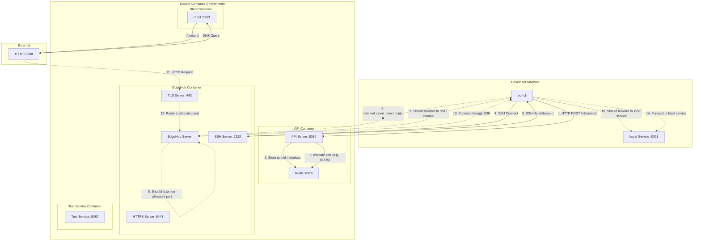
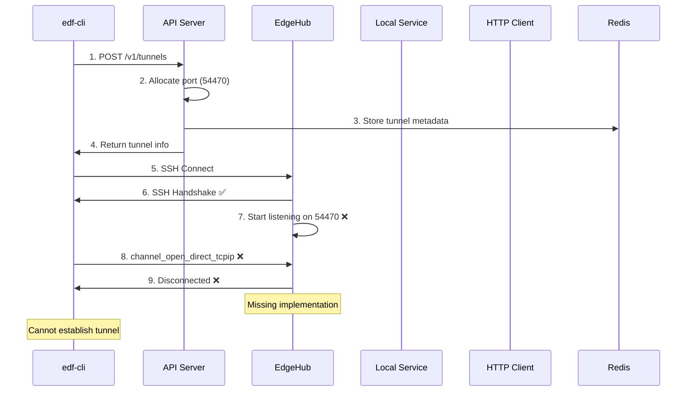

# FleetingDNS Connectivity Architecture

## Current Setup Analysis

This document outlines the current connectivity architecture based on the codebase analysis and testing results.

## Architecture Overview

## Current Status

### ✅ Working Components

1. **API Tunnel Registration**
   - CLI successfully creates tunnel via API
   - API allocates dynamic port (e.g., 54470)
   - Tunnel metadata stored in Redis

2. **SSH Connection**
   - CLI establishes SSH connection to EdgeHub
   - SSH handshake completes successfully
   - EdgeHub listens on port 2222

3. **DNS Resolution**
   - DNS service working (confirmed via dig-test container)
   - DNS queries resolve correctly

### ❌ Broken Components

1. **SSH Reverse Port Forwarding**
   - CLI attempts `channel_open_direct_tcpip` to allocated port
   - EdgeHub doesn't listen on allocated ports
   - Connection fails with "Disconnected" error

2. **Dynamic Port Listening**
   - EdgeHub allocates ports but doesn't start listeners
   - No TCP listeners on allocated ports (e.g., 54470)
   - Missing implementation in `start_tunnel_port_listener`

3. **Tunnel Data Flow**
   - No bidirectional data forwarding
   - SSH channels not properly connected to allocated ports
   - Local service not accessible through tunnel

## Key Issues Identified

### 1. Missing EdgeHub Implementation
- EdgeHub allocates ports but doesn't listen on them
- `start_tunnel_port_listener` method exists but not called
- No connection between allocated ports and SSH channels

### 2. SSH Channel Handling
- EdgeHub doesn't handle `channel_open_direct_tcpip` requests
- No mapping between SSH channels and allocated ports
- Missing reverse tunnel registration in SSH server

### 3. Data Forwarding Chain
- No bidirectional data flow implementation
- Missing connection between tunnel ports and local services
- No HTTP request/response forwarding

## Expected Flow (Not Working)

## Root Cause Analysis

The fundamental issue is that **EdgeHub is not listening on allocated tunnel ports**. The current implementation:

1. ✅ Allocates ports and stores them in Redis
2. ❌ Does not start TCP listeners on allocated ports
3. ❌ Does not handle SSH channel forwarding
4. ❌ Does not connect allocated ports to SSH channels

## Required Fixes

### 1. EdgeHub Port Listening
- Start TCP listeners on allocated ports
- Handle incoming connections on tunnel ports
- Forward data to/from SSH channels

### 2. SSH Channel Integration
- Map SSH channels to allocated ports
- Handle `channel_open_direct_tcpip` requests
- Implement bidirectional data forwarding

### 3. Complete Data Flow
- Connect tunnel ports → SSH channels → local services
- Implement HTTP request/response forwarding
- Handle connection lifecycle management

## Current Architecture Limitations

1. **Single Point of Failure**: SSH connection failure breaks entire tunnel
2. **No Load Balancing**: Single EdgeHub handles all tunnels
3. **Limited Scalability**: No multi-user tunnel support
4. **Missing Security**: No proper authentication/authorization
5. **No Monitoring**: Limited observability into tunnel health

## Next Steps

1. **Fix EdgeHub Port Listening**: Implement `start_tunnel_port_listener` properly
2. **SSH Channel Handling**: Connect allocated ports to SSH channels
3. **Data Forwarding**: Implement bidirectional data flow
4. **Testing**: Validate end-to-end tunnel functionality
5. **Monitoring**: Add tunnel health metrics and logging

---

*This document reflects the current state as of the SSH Tunnel Implementation Phase 0 testing.*
