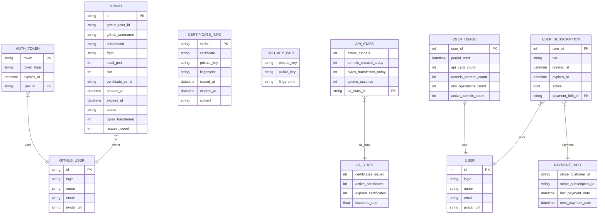
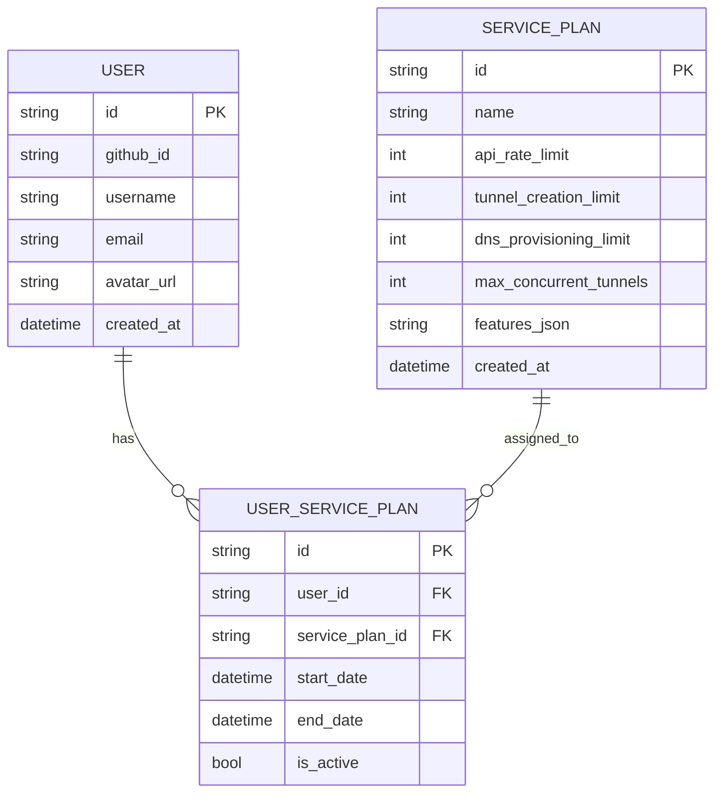
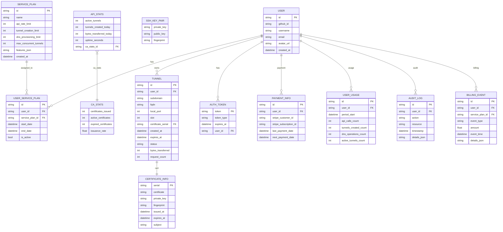

# Database Entity Model: Service Plan Management

## 1. Current Database Model (as implemented)

---

## 2. Proposed Database Model (Service Plan Management)

---

## 3. Future-State Database Model (Planned)

---

### Entity Summary Table

| Entity           | Main Fields / Role                                                                 |
|------------------|-----------------------------------------------------------------------------------|
| USER             | id, github_id, username, email, avatar_url, created_at                             |
| SERVICE_PLAN     | id, name, api_rate_limit, tunnel_creation_limit, dns_provisioning_limit, features  |
| USER_SERVICE_PLAN| id, user_id, service_plan_id, start_date, end_date, is_active                      |
| TUNNEL           | id, user_id, subdomain, fqdn, local_port, slot, certificate_serial, status         |
| AUTH_TOKEN       | token, token_type, expires_at, user_id                                             |
| CERTIFICATE_INFO | serial, certificate, private_key, fingerprint, issued_at, expires_at, subject      |
| SSH_KEY_PAIR     | private_key, public_key, fingerprint                                               |
| API_STATS        | active_tunnels, tunnels_created_today, bytes_transferred_today, uptime_seconds     |
| CA_STATS         | certificates_issued, active_certificates, expired_certificates, issuance_rate      |
| PAYMENT_INFO     | id, user_id, stripe_customer_id, subscription_id, last/next payment                |
| USER_USAGE       | id, user_id, period_start, api_calls_count, tunnels_created_count, dns_ops_count   |
| AUDIT_LOG        | id, user_id, action, resource, timestamp, details_json                             |
| BILLING_EVENT    | id, user_id, service_plan_id, event_type, amount, event_time, details_json         |

---

### Migration and Extensibility Notes

- **Migration:**
  - Migrate from enum-based `UserTier`/`UserSubscription` to DB-driven `ServicePlan`/`UserServicePlan`.
  - Move all tier/plan logic to the DB, removing hardcoded limits from code.
  - Update API logic to resolve user plan and limits via join tables.
  - No data migration needed if starting from scratch; otherwise, migrate user subscriptions and usage to new tables.

- **Extensibility:**
  - The future model supports:
    - Plan upgrades/downgrades and history (via `UserServicePlan`)
    - Audit logging for compliance and security (`AuditLog`)
    - Billing events for analytics and invoicing (`BillingEvent`)
    - Advanced usage tracking (`UserUsage`)
    - Feature flags and custom plan features (`features_json` on `ServicePlan`)
    - Easy integration with payment providers (via `PaymentInfo`)
    - Analytics and monitoring (via `ApiStats`, `CaStats`)
  - New entities can be added as needed (e.g., support tickets, notifications, etc.)

- **Actionable Next Steps:**
  - Refactor codebase to use the new model for all user/plan logic.
  - Implement API endpoints for plan management, audit, and billing as needed.
  - Document all new relationships and update onboarding guides for developers.

---

## Summary: Differences and Migration Path

- **Current Model:**
  - User tier/subscription is managed via `UserSubscription` and `UserTier` enums, with payment info and usage tracked in separate tables.
  - Tunnel, certificate, and stats entities are directly linked to users and their GitHub identity.
  - No explicit service plan abstraction; tier is an enum, not a DB entity.

- **Proposed Model:**
  - Introduces `ServicePlan` as a first-class entity, allowing flexible plan definitions and features.
  - `UserServicePlan` join table enables users to have plan history, upgrades, and custom plans.
  - Decouples user identity from plan/tier logic, supporting future extensibility (e.g., trials, enterprise features).

- **Migration Path:**
  - Migrate `UserTier`/`UserSubscription` to `ServicePlan`/`UserServicePlan`.
  - Move tier logic from enums to DB-driven configuration.
  - Update API logic to resolve user plan via join, not enum.
  - Retain usage and payment tracking, but link to new plan model. 