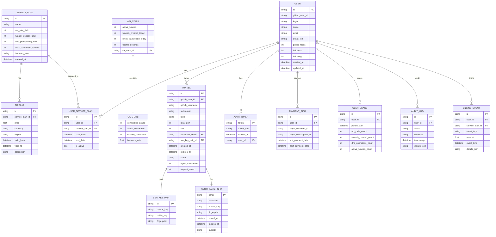

# Database Entity Model: Service Plan Management

## 1. Authentication Implementation Status ✅ COMPLETED

### ✅ **Completed Authentication Features**

1. **GitHub OAuth Integration** - ✅ IMPLEMENTED
   - Complete OAuth flow following [GitHub REST API specifications](https://docs.github.com/en/apps/oauth-apps/building-oauth-apps/authenticating-to-the-rest-api-with-an-oauth-app)
   - Authorization code exchange with proper error handling
   - Token validation with scope checking (`user:email`, `read:user`)
   - Hierarchical scope validation (e.g., `user` grants `user:email`)

2. **JWT Token System** - ✅ IMPLEMENTED
   - JWT token generation and validation
   - Token expiration handling (24-hour TTL)
   - Development bypass support for testing
   - Proper error handling for invalid/expired tokens

3. **Authentication Middleware** - ✅ IMPLEMENTED
   - Axum middleware for JWT validation
   - Public endpoint whitelisting (`/health`, `/v1/auth/*`, `/metrics`)
   - User context extraction from request extensions
   - Comprehensive error responses

4. **Enhanced GitHub User Model** - ✅ IMPLEMENTED
   - Extended `GitHubUser` struct with additional fields:
     - `public_repos`, `followers`, `following` counts
     - `created_at`, `updated_at` timestamps
   - Proper user information retrieval from GitHub API

5. **OAuth URL Generation** - ✅ IMPLEMENTED
   - New endpoint `/v1/auth/github/url` for client integration
   - Proper OAuth authorization URL generation
   - State parameter support for CSRF protection
   - Required scopes configuration

### 🔄 **Next Authentication Tasks**

1. **Database Integration** - 🔄 IN PROGRESS
   - Create database tables for user persistence
   - Implement user service plan resolution from database
   - Replace mock service plan with real database lookup
   - Add session management with Redis TTL

2. **Service Plan Integration** - ❌ NOT STARTED
   - Implement database-driven service plans
   - Add rate limiting based on service plans
   - Add usage tracking and quota enforcement
   - Implement audit logging for authentication events

---

## 2. Target Database Model (Future-State Implementation)



---

### Entity Summary Table

| Entity           | Main Fields / Role                                                                 |
|------------------|-----------------------------------------------------------------------------------|
| USER             | id, github_user_id, login, name, email, avatar_url, public_repos, followers, following, created_at, updated_at |
| SERVICE_PLAN     | id, name, api_rate_limit, tunnel_creation_limit, dns_provisioning_limit, features  |
| PRICING          | id, service_plan_id, price, currency, region, valid_from, valid_to, description    |
| USER_SERVICE_PLAN| id, user_id, service_plan_id, start_date, end_date, is_active                      |
| TUNNEL           | id, github_user_id, github_username, subdomain, fqdn, local_port, slot, certificate_serial, ssh_key_pair_id, status |
| SSH_KEY_PAIR     | id, private_key, public_key, fingerprint                                           |
| AUTH_TOKEN       | token, token_type, expires_at, user_id                                             |
| CERTIFICATE_INFO | serial, certificate, private_key, fingerprint, issued_at, expires_at, subject      |
| API_STATS        | active_tunnels, tunnels_created_today, bytes_transferred_today, uptime_seconds     |
| CA_STATS         | certificates_issued, active_certificates, expired_certificates, issuance_rate      |
| PAYMENT_INFO     | id, user_id, stripe_customer_id, subscription_id, last/next payment                |
| USER_USAGE       | id, user_id, period_start, api_calls_count, tunnels_created_count, dns_ops_count   |
| AUDIT_LOG        | id, user_id, action, resource, timestamp, details_json                             |
| BILLING_EVENT    | id, user_id, service_plan_id, event_type, amount, event_time, details_json         |

---

## 3. Database Implementation

We do not have any databse in place, so we will use PostgreSQL as our database engine. The following SQL schema defines the core tables required for user management, service plans, authentication, and tunnel management.
We will use SeaORM, in a crate called models, to manage our database models and migrations.

We do not want proliferation of databse code, so this must be consolidated in the models crate, 
and use orm to manage the database schema and migrations.


### Core Tables (Priority: HIGH)

```sql
-- User management
CREATE TABLE users (
    id VARCHAR(255) PRIMARY KEY,
    github_user_id VARCHAR(255) UNIQUE NOT NULL,
    login VARCHAR(255) NOT NULL,
    name VARCHAR(255),
    email VARCHAR(255),
    avatar_url TEXT,
    public_repos INTEGER,
    followers INTEGER,
    following INTEGER,
    created_at TIMESTAMP,
    updated_at TIMESTAMP,
    created_at_db TIMESTAMP DEFAULT CURRENT_TIMESTAMP
);

-- Service plan management
CREATE TABLE service_plans (
    id VARCHAR(50) PRIMARY KEY,
    name VARCHAR(100) NOT NULL,
    api_rate_limit INTEGER NOT NULL,
    tunnel_creation_limit INTEGER NOT NULL,
    dns_provisioning_limit INTEGER NOT NULL,
    max_concurrent_tunnels INTEGER NOT NULL,
    features_json JSONB,
    created_at TIMESTAMP DEFAULT CURRENT_TIMESTAMP
);

-- User service plan assignments
CREATE TABLE user_service_plans (
    id UUID PRIMARY KEY DEFAULT gen_random_uuid(),
    user_id VARCHAR(255) REFERENCES users(id),
    service_plan_id VARCHAR(50) REFERENCES service_plans(id),
    start_date TIMESTAMP NOT NULL,
    end_date TIMESTAMP,
    is_active BOOLEAN DEFAULT true,
    created_at TIMESTAMP DEFAULT CURRENT_TIMESTAMP
);

-- Authentication tokens
CREATE TABLE auth_tokens (
    token VARCHAR(255) PRIMARY KEY,
    token_type VARCHAR(50) NOT NULL,
    expires_at TIMESTAMP NOT NULL,
    user_id VARCHAR(255) REFERENCES users(id),
    created_at TIMESTAMP DEFAULT CURRENT_TIMESTAMP
);

-- Tunnel management
CREATE TABLE tunnels (
    id UUID PRIMARY KEY DEFAULT gen_random_uuid(),
    github_user_id VARCHAR(255) REFERENCES users(github_user_id),
    github_username VARCHAR(255) NOT NULL,
    subdomain VARCHAR(255) NOT NULL,
    fqdn VARCHAR(255) NOT NULL,
    local_port INTEGER NOT NULL,
    slot INTEGER NOT NULL,
    certificate_serial VARCHAR(255),
    ssh_key_pair_id UUID REFERENCES ssh_key_pairs(id),
    created_at TIMESTAMP DEFAULT CURRENT_TIMESTAMP,
    expires_at TIMESTAMP NOT NULL,
    status VARCHAR(50) DEFAULT 'active',
    bytes_transferred BIGINT DEFAULT 0,
    request_count INTEGER DEFAULT 0
);

-- SSH key pairs (per-tunnel isolation)
CREATE TABLE ssh_key_pairs (
    id UUID PRIMARY KEY DEFAULT gen_random_uuid(),
    private_key TEXT NOT NULL,
    public_key TEXT NOT NULL,
    fingerprint VARCHAR(255) NOT NULL,
    created_at TIMESTAMP DEFAULT CURRENT_TIMESTAMP
);

-- Certificate management
CREATE TABLE certificate_info (
    serial VARCHAR(255) PRIMARY KEY,
    certificate TEXT NOT NULL,
    private_key TEXT NOT NULL,
    fingerprint VARCHAR(255) NOT NULL,
    issued_at TIMESTAMP NOT NULL,
    expires_at TIMESTAMP NOT NULL,
    subject VARCHAR(255) NOT NULL
);
```

### Analytics & Billing Tables (Priority: MEDIUM)

```sql
-- Usage tracking
CREATE TABLE user_usage (
    id UUID PRIMARY KEY DEFAULT gen_random_uuid(),
    user_id VARCHAR(255) REFERENCES users(id),
    period_start TIMESTAMP NOT NULL,
    api_calls_count INTEGER DEFAULT 0,
    tunnels_created_count INTEGER DEFAULT 0,
    dns_operations_count INTEGER DEFAULT 0,
    active_tunnels_count INTEGER DEFAULT 0
);

-- Audit logging
CREATE TABLE audit_log (
    id UUID PRIMARY KEY DEFAULT gen_random_uuid(),
    user_id VARCHAR(255) REFERENCES users(id),
    action VARCHAR(100) NOT NULL,
    resource VARCHAR(255) NOT NULL,
    timestamp TIMESTAMP DEFAULT CURRENT_TIMESTAMP,
    details_json JSONB
);

-- Payment information
CREATE TABLE payment_info (
    id UUID PRIMARY KEY DEFAULT gen_random_uuid(),
    user_id VARCHAR(255) REFERENCES users(id),
    stripe_customer_id VARCHAR(255),
    stripe_subscription_id VARCHAR(255),
    last_payment_date TIMESTAMP,
    next_payment_date TIMESTAMP
);

-- Billing events
CREATE TABLE billing_events (
    id UUID PRIMARY KEY DEFAULT gen_random_uuid(),
    user_id VARCHAR(255) REFERENCES users(id),
    service_plan_id VARCHAR(50) REFERENCES service_plans(id),
    event_type VARCHAR(50) NOT NULL,
    amount DECIMAL(10,2),
    event_time TIMESTAMP DEFAULT CURRENT_TIMESTAMP,
    details_json JSONB
);

-- Pricing management
CREATE TABLE pricing (
    id UUID PRIMARY KEY DEFAULT gen_random_uuid(),
    service_plan_id VARCHAR(50) REFERENCES service_plans(id),
    price DECIMAL(10,2) NOT NULL,
    currency VARCHAR(3) DEFAULT 'USD',
    region VARCHAR(50),
    valid_from TIMESTAMP NOT NULL,
    valid_to TIMESTAMP,
    description TEXT
);
```

### Statistics Tables (Priority: LOW)

```sql
-- API statistics
CREATE TABLE api_stats (
    id UUID PRIMARY KEY DEFAULT gen_random_uuid(),
    active_tunnels INTEGER DEFAULT 0,
    tunnels_created_today INTEGER DEFAULT 0,
    bytes_transferred_today BIGINT DEFAULT 0,
    uptime_seconds BIGINT DEFAULT 0,
    ca_stats_id UUID REFERENCES ca_stats(id),
    created_at TIMESTAMP DEFAULT CURRENT_TIMESTAMP
);

-- Certificate authority statistics
CREATE TABLE ca_stats (
    id UUID PRIMARY KEY DEFAULT gen_random_uuid(),
    certificates_issued INTEGER DEFAULT 0,
    active_certificates INTEGER DEFAULT 0,
    expired_certificates INTEGER DEFAULT 0,
    issuance_rate DECIMAL(5,2) DEFAULT 0.0,
    created_at TIMESTAMP DEFAULT CURRENT_TIMESTAMP
);
```

---

## 4. Authentication Integration Implementation

### Database-Driven Authentication Flow

```rust
// Enhanced authentication with database integration
pub async fn validate_jwt_token_with_plan(
    token: &str,
    secret: &str,
    db_pool: &PgPool,
) -> AuthResult<AuthenticatedUserWithPlan> {
    let user = validate_jwt_token(token, secret)?;
    
    // Look up user's active service plan from database
    let service_plan = get_user_active_service_plan(db_pool, &user.id).await?;
    
    Ok(AuthenticatedUserWithPlan {
        user,
        service_plan,
    })
}

// Database user lookup
pub async fn get_user_by_github_user_id(
    db_pool: &PgPool,
    github_user_id: &str,
) -> Result<Option<User>, sqlx::Error> {
    sqlx::query_as!(
        User,
        "SELECT * FROM users WHERE github_user_id = $1",
        github_user_id
    )
    .fetch_optional(db_pool)
    .await
}

// Service plan resolution
pub async fn get_user_active_service_plan(
    db_pool: &PgPool,
    user_id: &str,
) -> Result<ServicePlan, sqlx::Error> {
    sqlx::query_as!(
        ServicePlan,
        r#"
        SELECT sp.* FROM service_plans sp
        JOIN user_service_plans usp ON sp.id = usp.service_plan_id
        WHERE usp.user_id = $1 AND usp.is_active = true
        AND (usp.end_date IS NULL OR usp.end_date > NOW())
        ORDER BY usp.start_date DESC
        LIMIT 1
        "#,
        user_id
    )
    .fetch_one(db_pool)
    .await
}
```

### Rate Limiting Integration

```rust
// Service plan-based rate limiting
pub async fn check_rate_limit(
    github_user_id: &str,
    action: &str,
    db_pool: &PgPool,
    redis_pool: &RedisPool,
) -> Result<bool, RateLimitError> {
    let service_plan = get_user_active_service_plan(db_pool, github_user_id).await?;
    
    let limit = match action {
        "api_call" => service_plan.api_rate_limit,
        "tunnel_creation" => service_plan.tunnel_creation_limit,
        "dns_operation" => service_plan.dns_provisioning_limit,
        _ => return Err(RateLimitError::UnknownAction),
    };
    
    // Check current usage against limit
    let current_usage = get_current_usage(redis_pool, github_user_id, action).await?;
    
    Ok(current_usage < limit)
}
```

---

## 5. Implementation Roadmap

### Phase 1: Core Database (Week 1-2)
- [ ] Execute core table migrations (users, service_plans, user_service_plans)
- [ ] Implement database-driven authentication flow
- [ ] Replace mock service plan with database lookup
- [ ] Add user persistence and session management

### Phase 2: Service Plan Integration (Week 3-4)
- [ ] Implement service plan resolution in authentication
- [ ] Add rate limiting based on service plans
- [ ] Implement usage tracking and quota enforcement
- [ ] Add audit logging for authentication events

### Phase 3: Analytics & Billing (Week 5-6)
- [ ] Implement usage tracking tables
- [ ] Add payment information and billing events
- [ ] Create analytics dashboard
- [ ] Implement pricing management

### Phase 4: Advanced Features (Week 7-8)
- [ ] Add per-tunnel SSH key isolation
- [ ] Implement certificate management
- [ ] Add advanced audit logging
- [ ] Create comprehensive monitoring

---

## Summary: Target Implementation

- **✅ COMPLETED**: GitHub OAuth integration, JWT system, authentication middleware
- **🔄 NEXT**: Database integration for user persistence and service plan management
- **🎯 TARGET**: Complete database-driven authentication and authorization system

The target database model provides a comprehensive foundation for:
- **User Management**: GitHub OAuth integration with persistent user data
- **Service Plans**: Flexible, database-driven service plan management
- **Rate Limiting**: Service plan-based quota enforcement
- **Analytics**: Comprehensive usage tracking and billing
- **Security**: Audit logging and per-tunnel SSH key isolation
- **Scalability**: Support for pricing tiers and enterprise features 