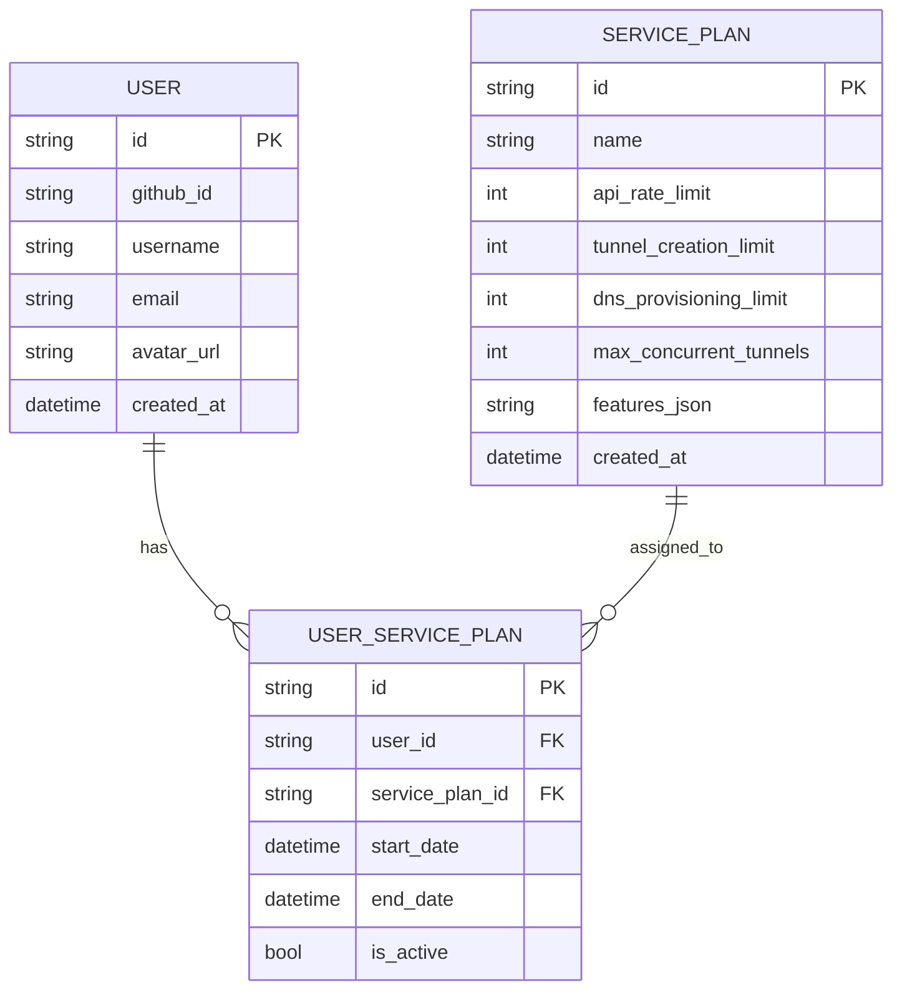

# Database Entity Model: Service Plan Management

This model supports associating users with service plans (tiers) independently of the GitHubUser struct.

---

---

## Notes
- **GitHubUser** does not have a `tier` field. User tier/plan is determined by joining `User` to `ServicePlan` via `UserServicePlan`.
- The API should look up the user's active service plan to determine rate limits and features.
- This model supports plan upgrades, history, and future extensibility (e.g., trial periods, custom plans). 