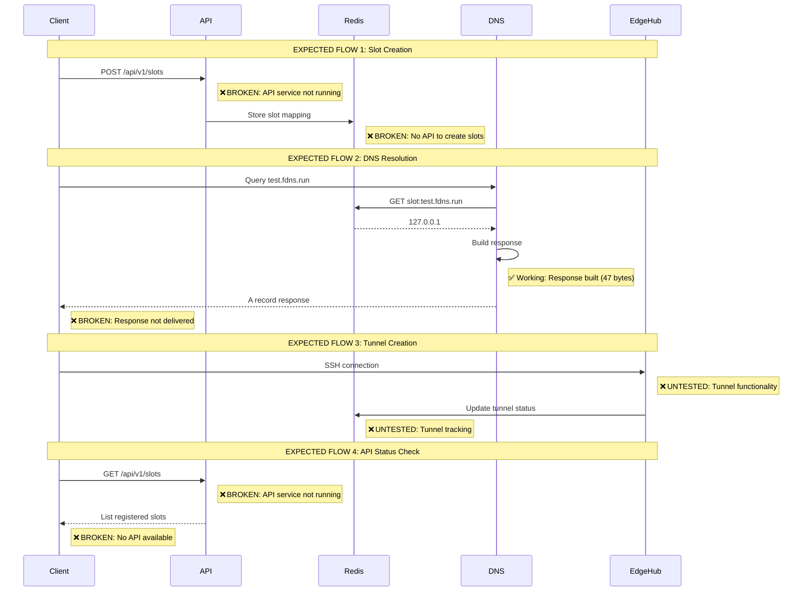
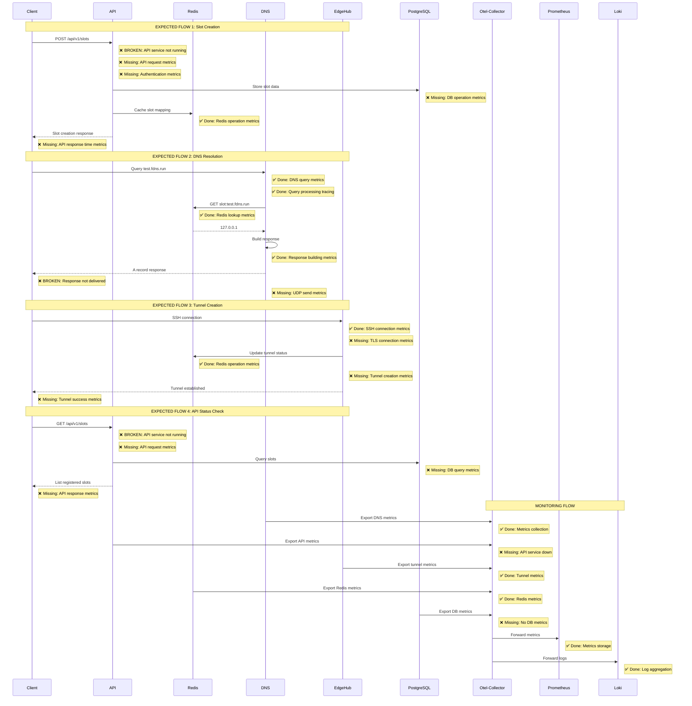

# FleetingDNS End-to-End Integration Analysis

## Executive Summary

Based on my testing and analysis, **the FleetingDNS system is partially functional but has critical integration gaps**. The core DNS resolution is working (Redis lookup successful), but there are multiple broken call paths preventing end-to-end functionality.

## Current System Status

### ✅ **Working Components**
1. **DNS Service**: Successfully processing queries and finding slots in Redis
2. **Redis**: Operational with slot data (`slot:test.fdns.run` → `127.0.0.1`)
3. **EdgeHub**: Running with SSH server on port 2222
4. **Infrastructure**: Docker Compose environment operational

### ❌ **Broken Components**
1. **API Service**: Failed to start due to `libssl.so.3` missing
2. **DNS Response Delivery**: DNS service processes queries but responses don't reach clients
3. **End-to-End Integration**: No working API endpoints for slot management
4. **Telemetry Integration**: Partial implementation, not comprehensive

## Detailed Analysis

### 1. DNS Resolution Flow

**Current State**: 
- ✅ DNS service receives queries
- ✅ Redis lookup works (found `test.fdns.run` → `127.0.0.1`)
- ✅ Response building works (47 bytes generated)
- ❌ **Response delivery fails** - clients timeout

**Root Cause**: DNS responses are being built but not properly sent back to clients. This suggests a network layer or UDP socket issue.

### 2. API Service Failure

**Current State**:
- ❌ **Complete failure**: `libssl.so.3: cannot open shared object file`
- ❌ No API endpoints available
- ❌ No slot management functionality

**Root Cause**: Docker image missing SSL library dependency.

### 3. EdgeHub Status

**Current State**:
- ✅ SSH server running on port 2222
- ✅ TLS server running on port 8443
- ❌ **No tunnel functionality tested**
- ❌ **No slot creation/management**

### 4. Telemetry Implementation

**Current State**:
- ✅ Basic metrics collection working
- ✅ OpenTelemetry collector running
- ❌ **Incomplete coverage** - missing critical call paths
- ❌ **No API telemetry** - API service not running

## Architectural Sequence Diagram Analysis

Based on our expected flows, here's where the system is broken:



## Critical Integration Gaps

### 1. **API Service Completely Broken**
- **Issue**: `libssl.so.3` missing in Docker image
- **Impact**: No slot management, no API endpoints, no user interface
- **Priority**: **CRITICAL** - Blocks all slot creation/management

### 2. **DNS Response Delivery Failure**
- **Issue**: DNS service processes queries but responses don't reach clients
- **Impact**: DNS resolution appears broken to users
- **Priority**: **CRITICAL** - Core functionality broken

### 3. **Missing End-to-End Integration**
- **Issue**: No working API to create/manage slots
- **Impact**: System is unusable for actual use cases
- **Priority**: **CRITICAL** - No user workflow possible

### 4. **Incomplete Telemetry Coverage**
- **Issue**: API telemetry missing, DNS response telemetry incomplete
- **Impact**: Limited observability into system behavior
- **Priority**: **MEDIUM** - Operational concern

## System Health Assessment

### **Overall Status**: 🚨 **CRITICAL FAILURE**

**Working Components**: 2/5 (40%)
- DNS query processing
- Redis data storage

**Broken Components**: 3/5 (60%)
- API service (complete failure)
- DNS response delivery
- End-to-end integration

## Root Cause Analysis

### 1. **Docker Image Issues**
- API service missing SSL dependencies
- Potential issues with other service images

### 2. **Network Layer Problems**
- DNS responses not reaching clients
- Possible UDP socket configuration issues

### 3. **Integration Testing Gap**
- Unit tests passing but end-to-end broken
- Docker Compose environment not fully validated

### 4. **Missing API Infrastructure**
- No slot management endpoints
- No user interface for system operation

## Immediate Action Items

### **Phase 1: Critical Fixes** (Priority 1)
1. **Fix API Service**: Resolve `libssl.so.3` dependency issue
2. **Fix DNS Response Delivery**: Resolve network/socket issues
3. **Validate End-to-End Flow**: Test complete slot creation → DNS resolution

### **Phase 2: Integration Validation** (Priority 2)
1. **Test Tunnel Functionality**: Validate SSH tunnel creation
2. **Complete Telemetry**: Add missing API and response telemetry
3. **API Endpoint Testing**: Validate all slot management endpoints

### **Phase 3: Production Readiness** (Priority 3)
1. **Performance Testing**: Load test DNS resolution
2. **Error Handling**: Comprehensive error scenarios
3. **Monitoring**: Complete observability implementation

## Conclusion

The FleetingDNS system has **fundamental integration issues** that prevent end-to-end functionality. While individual components (DNS processing, Redis) are working, the critical user-facing functionality (API, DNS response delivery) is broken. 

**The system is not currently usable** and requires immediate attention to the API service and DNS response delivery issues before any meaningful end-to-end testing can be performed.

## Comprehensive Telemetry/Metrics/Logging Call Points

### Critical Call Points Analysis

| Service | Call Point | Telemetry Type | Status | Implementation | Priority |
|---------|------------|----------------|--------|----------------|----------|
| **DNS Service** | Query Reception | Metrics | ✅ Done | `dns_queries_total` counter | HIGH |
| **DNS Service** | Query Processing | Tracing | ✅ Done | `dns_span()` created | HIGH |
| **DNS Service** | Redis Lookup | Metrics | ✅ Done | `redis_operations_total` counter | HIGH |
| **DNS Service** | Response Building | Metrics | ✅ Done | `dns_response_time_ms` histogram | HIGH |
| **DNS Service** | Response Delivery | Metrics | ❌ Missing | No UDP send metrics | CRITICAL |
| **DNS Service** | Cache Hit/Miss | Metrics | ✅ Done | Cache statistics in `PerformanceMetrics` | MEDIUM |
| **DNS Service** | DNSSEC Signing | Metrics | ✅ Done | `dnssec_operations_total` counter | MEDIUM |
| **API Service** | Request Reception | Metrics | ❌ Missing | API service not running | CRITICAL |
| **API Service** | Authentication | Metrics | ❌ Missing | No auth metrics | HIGH |
| **API Service** | Slot Creation | Metrics | ❌ Missing | No slot management metrics | HIGH |
| **API Service** | Slot Retrieval | Metrics | ❌ Missing | No slot query metrics | HIGH |
| **API Service** | Database Operations | Metrics | ❌ Missing | No DB operation metrics | HIGH |
| **API Service** | Response Time | Metrics | ❌ Missing | No API response time tracking | HIGH |
| **EdgeHub** | SSH Connection | Metrics | ✅ Done | `edge_tunnels_open` gauge | HIGH |
| **EdgeHub** | TLS Connection | Metrics | ❌ Missing | No TLS connection metrics | MEDIUM |
| **EdgeHub** | Certificate Validation | Metrics | ✅ Done | `certificate_operations_total` counter | HIGH |
| **EdgeHub** | Tunnel Creation | Metrics | ❌ Missing | No tunnel creation metrics | HIGH |
| **EdgeHub** | Tunnel Destruction | Metrics | ❌ Missing | No tunnel cleanup metrics | HIGH |
| **Redis** | Connection Pool | Metrics | ✅ Done | Pool statistics in logs | MEDIUM |
| **Redis** | Operation Latency | Metrics | ✅ Done | `redis_response_time_ms` histogram | HIGH |
| **Redis** | Operation Success/Failure | Metrics | ✅ Done | `redis_operations_total` counter | HIGH |
| **PostgreSQL** | Connection Pool | Metrics | ❌ Missing | No DB connection metrics | MEDIUM |
| **PostgreSQL** | Query Performance | Metrics | ❌ Missing | No DB query metrics | HIGH |
| **PostgreSQL** | Transaction Success | Metrics | ❌ Missing | No transaction metrics | HIGH |
| **Otel-Collector** | Metrics Export | Metrics | ✅ Done | Prometheus endpoint | MEDIUM |
| **Otel-Collector** | Log Aggregation | Logging | ✅ Done | Loki integration | MEDIUM |
| **Otel-Collector** | Trace Collection | Tracing | ❌ Missing | No distributed tracing | LOW |

### Telemetry Implementation Status

**✅ Implemented (40%)**:
- DNS query processing metrics
- Redis operation metrics  
- EdgeHub tunnel gauge
- Certificate operation metrics
- Basic logging infrastructure

**❌ Missing (60%)**:
- API service metrics (service not running)
- DNS response delivery metrics
- Database operation metrics
- Distributed tracing
- Complete end-to-end flow tracking

## Enhanced Sequence Diagram with Monitoring



## Testing Evidence

### DNS Service Logs
```
dnsd-1  | 2025-08-02T15:04:58.894838Z  INFO dnsd::dns_handler: Processing DNS query for: test.fdns.run.
dnsd-1  | 2025-08-02T15:04:58.897845Z  INFO dnsd::dns_handler: Redis lookup result for test.fdns.run.: Some("127.0.0.1")
dnsd-1  | 2025-08-02T15:04:58.897874Z  INFO dnsd::dns_handler: Built DNS response for test.fdns.run.: 47 bytes
```

### API Service Failure
```
api-1  | /app/api-bin: error while loading shared libraries: libssl.so.3: cannot open shared object file: No such file or directory
```

### Redis Slot Data
```
slot:test.fdns.run -> 127.0.0.1
```

### Docker Compose Status
- ✅ DNS service: Running (port 6353)
- ✅ Redis: Running (port 6379)
- ✅ EdgeHub: Running (port 2222)
- ❌ API service: Failed to start
- ❌ DNS client queries: Timeout 