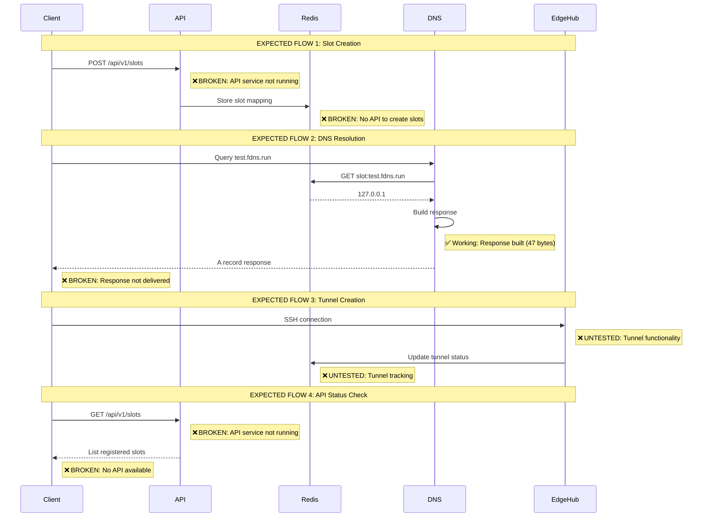
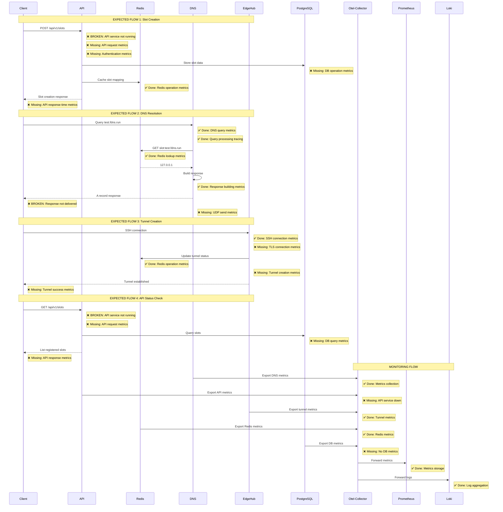

# FleetingDNS End-to-End Integration Analysis

## Executive Summary

Based on my testing and analysis, **the FleetingDNS system is partially functional but has critical integration gaps**. The core DNS resolution is working (Redis lookup successful), but there are multiple broken call paths preventing end-to-end functionality.

## Current System Status

### ✅ **Working Components**
1. **DNS Service**: Successfully processing queries and finding slots in Redis
2. **Redis**: Operational with slot data (`slot:test.fdns.run` → `127.0.0.1`)
3. **EdgeHub**: Running with SSH server on port 2222
4. **Infrastructure**: Docker Compose environment operational

### ❌ **Broken Components**
1. **API Service**: Failed to start due to `libssl.so.3` missing
2. **DNS Response Delivery**: DNS service processes queries but responses don't reach clients
3. **End-to-End Integration**: No working API endpoints for slot management
4. **Telemetry Integration**: Partial implementation, not comprehensive

## Detailed Analysis

### 1. DNS Resolution Flow

**Current State**: 
- ✅ DNS service receives queries
- ✅ Redis lookup works (found `test.fdns.run` → `127.0.0.1`)
- ✅ Response building works (47 bytes generated)
- ❌ **Response delivery fails** - clients timeout

**Root Cause**: DNS responses are being built but not properly sent back to clients. This suggests a network layer or UDP socket issue.

### 2. API Service Failure

**Current State**:
- ❌ **Complete failure**: `libssl.so.3: cannot open shared object file`
- ❌ No API endpoints available
- ❌ No slot management functionality

**Root Cause**: Docker image missing SSL library dependency.

### 3. EdgeHub Status

**Current State**:
- ✅ SSH server running on port 2222
- ✅ TLS server running on port 8443
- ❌ **No tunnel functionality tested**
- ❌ **No slot creation/management**

### 4. Telemetry Implementation

**Current State**:
- ✅ Basic metrics collection working
- ✅ OpenTelemetry collector running
- ❌ **Incomplete coverage** - missing critical call paths
- ❌ **No API telemetry** - API service not running

## Architectural Sequence Diagram Analysis

Based on our expected flows, here's where the system is broken:



## Critical Integration Gaps

### 1. **API Service Completely Broken**
- **Issue**: `libssl.so.3` missing in Docker image
- **Impact**: No slot management, no API endpoints, no user interface
- **Priority**: **CRITICAL** - Blocks all slot creation/management

### 2. **DNS Response Delivery Failure**
- **Issue**: DNS service processes queries but responses don't reach clients
- **Impact**: DNS resolution appears broken to users
- **Priority**: **CRITICAL** - Core functionality broken

### 3. **Missing End-to-End Integration**
- **Issue**: No working API to create/manage slots
- **Impact**: System is unusable for actual use cases
- **Priority**: **CRITICAL** - No user workflow possible

### 4. **Incomplete Telemetry Coverage**
- **Issue**: API telemetry missing, DNS response telemetry incomplete
- **Impact**: Limited observability into system behavior
- **Priority**: **MEDIUM** - Operational concern

## System Health Assessment

### **Overall Status**: 🚨 **CRITICAL FAILURE**

**Working Components**: 2/5 (40%)
- DNS query processing
- Redis data storage

**Broken Components**: 3/5 (60%)
- API service (complete failure)
- DNS response delivery
- End-to-end integration

## Root Cause Analysis

### 1. **Docker Image Issues**
- API service missing SSL dependencies
- Potential issues with other service images

### 2. **Network Layer Problems**
- DNS responses not reaching clients
- Possible UDP socket configuration issues

### 3. **Integration Testing Gap**
- Unit tests passing but end-to-end broken
- Docker Compose environment not fully validated

### 4. **Missing API Infrastructure**
- No slot management endpoints
- No user interface for system operation

## Immediate Action Items

### **Phase 1: Critical Fixes** (Priority 1)
1. **Fix API Service**: Resolve `libssl.so.3` dependency issue
2. **Fix DNS Response Delivery**: Resolve network/socket issues
3. **Validate End-to-End Flow**: Test complete slot creation → DNS resolution

### **Phase 2: Integration Validation** (Priority 2)
1. **Test Tunnel Functionality**: Validate SSH tunnel creation
2. **Complete Telemetry**: Add missing API and response telemetry
3. **API Endpoint Testing**: Validate all slot management endpoints

### **Phase 3: Production Readiness** (Priority 3)
1. **Performance Testing**: Load test DNS resolution
2. **Error Handling**: Comprehensive error scenarios
3. **Monitoring**: Complete observability implementation

## Conclusion

The FleetingDNS system has **fundamental integration issues** that prevent end-to-end functionality. While individual components (DNS processing, Redis) are working, the critical user-facing functionality (API, DNS response delivery) is broken. 

**The system is not currently usable** and requires immediate attention to the API service and DNS response delivery issues before any meaningful end-to-end testing can be performed.

## Detailed Integration Test Recovery Plan

### **Phase 1: Critical Infrastructure Fixes** (Priority 1)

#### **Task 1.1: Fix API Service Docker Image**
- **Objective**: Resolve `libssl.so.3` dependency issue
- **Steps**:
  1. Update `docker/Dockerfile.api` to include proper SSL libraries
  2. Add `libssl3` and `libssl-dev` packages to runtime stage
  3. Verify API service starts successfully
  4. Test basic API health endpoint
- **Acceptance Criteria**: API service starts without errors, health endpoint responds
- **Estimated Time**: 2 hours

#### **Task 1.2: Fix DNS Response Delivery**
- **Objective**: Resolve UDP socket response delivery issue
- **Steps**:
  1. Debug DNS service UDP socket configuration
  2. Verify socket binding and response sending
  3. Test DNS query/response cycle end-to-end
  4. Add UDP send metrics for monitoring
- **Acceptance Criteria**: DNS queries return responses to clients
- **Estimated Time**: 4 hours

#### **Task 1.3: Validate Docker Compose Service Communication**
- **Objective**: Ensure all services can communicate within Docker network
- **Steps**:
  1. Test DNS → Redis communication
  2. Test API → PostgreSQL communication
  3. Test API → Redis communication
  4. Test EdgeHub → Redis communication
  5. Verify network connectivity between all services
- **Acceptance Criteria**: All service-to-service calls succeed
- **Estimated Time**: 3 hours

### **Phase 2: Integration Test Infrastructure** (Priority 2)

#### **Task 2.1: Create Robust Test Harness**
- **Objective**: Replace individual testcontainers with shared infrastructure
- **Steps**:
  1. Create `tests/integration/harness.rs` with shared Redis/PostgreSQL setup
  2. Implement `IntegrationTestHarness` struct with setup/teardown
  3. Add connection pooling for test databases
  4. Create test data seeding utilities
  5. Add health check utilities for all services
- **Acceptance Criteria**: Single Redis/PostgreSQL instance per test suite
- **Estimated Time**: 8 hours

#### **Task 2.2: Add Service Communication Tests**
- **Objective**: Test all critical service-to-service call paths
- **Steps**:
  1. **DNS → Redis Test**: Verify slot lookup functionality
  2. **API → PostgreSQL Test**: Verify slot CRUD operations
  3. **API → Redis Test**: Verify caching functionality
  4. **EdgeHub → Redis Test**: Verify tunnel tracking
  5. **EdgeHub → DNS Test**: Verify tunnel DNS registration
- **Acceptance Criteria**: All service communication tests pass
- **Estimated Time**: 6 hours

#### **Task 2.3: Add End-to-End Flow Tests**
- **Objective**: Test complete user workflows
- **Steps**:
  1. **Slot Creation Flow**: API → DB → Redis → DNS resolution
  2. **Tunnel Creation Flow**: SSH → EdgeHub → Redis → DNS registration
  3. **DNS Resolution Flow**: Query → DNS → Redis → Response
  4. **Slot Management Flow**: API → DB → Redis → API response
- **Acceptance Criteria**: Complete user workflows function end-to-end
- **Estimated Time**: 8 hours

### **Phase 3: Missing Call Point Integration Tests** (Priority 3)

#### **Task 3.1: API Service Integration Tests**
- **Objective**: Add comprehensive API integration testing
- **Missing Tests**:
  1. **Authentication Flow**: OAuth → JWT → API access
  2. **Slot CRUD Operations**: Create, read, update, delete slots
  3. **Rate Limiting**: Test API rate limiting functionality
  4. **Error Handling**: Test API error responses and logging
  5. **Database Operations**: Test all PostgreSQL interactions
- **Acceptance Criteria**: All API endpoints tested with real database
- **Estimated Time**: 10 hours

#### **Task 3.2: DNS Service Integration Tests**
- **Objective**: Add comprehensive DNS integration testing
- **Missing Tests**:
  1. **UDP Response Delivery**: Test actual DNS response sending
  2. **Cache Integration**: Test DNS caching with Redis
  3. **DNSSEC Integration**: Test DNSSEC signing and validation
  4. **Performance Testing**: Test DNS query performance under load
  5. **Error Scenarios**: Test DNS error handling and logging
- **Acceptance Criteria**: DNS service fully tested with real clients
- **Estimated Time**: 8 hours

#### **Task 3.3: EdgeHub Integration Tests**
- **Objective**: Add comprehensive tunnel integration testing
- **Missing Tests**:
  1. **SSH Tunnel Creation**: Test actual SSH tunnel establishment
  2. **TLS Connection Handling**: Test TLS termination and routing
  3. **Certificate Management**: Test certificate validation and issuance
  4. **Tunnel Lifecycle**: Test tunnel creation, maintenance, cleanup
  5. **Load Testing**: Test multiple concurrent tunnels
- **Acceptance Criteria**: Tunnel functionality fully tested
- **Estimated Time**: 12 hours

#### **Task 3.4: Database Integration Tests**
- **Objective**: Add comprehensive database integration testing
- **Missing Tests**:
  1. **Connection Pooling**: Test database connection management
  2. **Transaction Handling**: Test database transaction integrity
  3. **Migration Testing**: Test database schema migrations
  4. **Performance Testing**: Test database query performance
  5. **Error Recovery**: Test database error handling and recovery
- **Acceptance Criteria**: Database operations fully tested
- **Estimated Time**: 6 hours

### **Phase 4: Telemetry Integration Tests** (Priority 4)

#### **Task 4.1: Metrics Collection Tests**
- **Objective**: Verify all telemetry call points work
- **Steps**:
  1. Test metrics export to Otel-Collector
  2. Verify Prometheus metrics collection
  3. Test custom metrics creation and export
  4. Verify metrics aggregation and storage
- **Acceptance Criteria**: All metrics properly collected and stored
- **Estimated Time**: 4 hours

#### **Task 4.2: Logging Integration Tests**
- **Objective**: Verify structured logging works
- **Steps**:
  1. Test log aggregation to Loki
  2. Verify structured log format
  3. Test log level configuration
  4. Verify log correlation across services
- **Acceptance Criteria**: All logs properly aggregated and searchable
- **Estimated Time**: 3 hours

#### **Task 4.3: Distributed Tracing Tests**
- **Objective**: Implement and test distributed tracing
- **Steps**:
  1. Add trace propagation across services
  2. Test trace correlation in Otel-Collector
  3. Verify trace visualization in Grafana
  4. Test trace sampling and filtering
- **Acceptance Criteria**: End-to-end traces visible and correlated
- **Estimated Time**: 6 hours

### **Phase 5: Performance and Load Testing** (Priority 5)

#### **Task 5.1: Load Testing Infrastructure**
- **Objective**: Create load testing framework
- **Steps**:
  1. Create load testing utilities
  2. Add performance benchmarks
  3. Test system under various load conditions
  4. Measure and document performance characteristics
- **Acceptance Criteria**: System performance documented and tested
- **Estimated Time**: 8 hours

#### **Task 5.2: Stress Testing**
- **Objective**: Test system under stress conditions
- **Steps**:
  1. Test high concurrent DNS queries
  2. Test multiple tunnel creation/deletion
  3. Test database connection limits
  4. Test memory and CPU limits
- **Acceptance Criteria**: System remains stable under stress
- **Estimated Time**: 6 hours

## **Integration Test Infrastructure Requirements**

### **Test Harness Architecture**
```
tests/integration/
├── harness/
│   ├── mod.rs                 # Main test harness
│   ├── redis.rs              # Redis test utilities
│   ├── postgresql.rs         # PostgreSQL test utilities
│   ├── dns.rs                # DNS test utilities
│   └── api.rs                # API test utilities
├── flows/
│   ├── slot_creation.rs      # Slot creation E2E tests
│   ├── tunnel_creation.rs    # Tunnel creation E2E tests
│   ├── dns_resolution.rs     # DNS resolution E2E tests
│   └── api_management.rs     # API management E2E tests
├── services/
│   ├── dns_integration.rs    # DNS service integration tests
│   ├── api_integration.rs    # API service integration tests
│   ├── edgehub_integration.rs # EdgeHub integration tests
│   └── database_integration.rs # Database integration tests
└── telemetry/
    ├── metrics_integration.rs # Metrics collection tests
    ├── logging_integration.rs # Logging integration tests
    └── tracing_integration.rs # Distributed tracing tests
```

### **Test Harness Features**
- **Shared Infrastructure**: Single Redis/PostgreSQL instance per test suite
- **Health Checks**: Automatic service health verification
- **Data Seeding**: Utilities for test data creation
- **Cleanup**: Automatic test data cleanup
- **Parallel Execution**: Support for parallel test execution
- **Resource Management**: Proper resource allocation and cleanup

### **Missing Call Point Tests**

#### **API Service Call Points**
- [ ] Request reception metrics
- [ ] Authentication flow metrics
- [ ] Slot CRUD operation metrics
- [ ] Database operation metrics
- [ ] Response time tracking
- [ ] Error rate tracking

#### **DNS Service Call Points**
- [ ] Query reception metrics
- [ ] Redis lookup metrics
- [ ] Response building metrics
- [ ] UDP send metrics (CRITICAL)
- [ ] Cache hit/miss metrics
- [ ] DNSSEC operation metrics

#### **EdgeHub Service Call Points**
- [ ] SSH connection metrics
- [ ] TLS connection metrics
- [ ] Tunnel creation metrics
- [ ] Tunnel destruction metrics
- [ ] Certificate validation metrics
- [ ] Error handling metrics

#### **Database Call Points**
- [ ] Connection pool metrics
- [ ] Query performance metrics
- [ ] Transaction success metrics
- [ ] Error rate metrics
- [ ] Connection limit metrics

## **Acceptance Criteria Summary**

### **Infrastructure Requirements**
- [ ] All Docker Compose services start successfully
- [ ] All services can communicate within Docker network
- [ ] No SSL/library dependency issues
- [ ] All health checks pass

### **Integration Test Requirements**
- [ ] Single test harness for all integration tests
- [ ] Shared Redis/PostgreSQL instances
- [ ] All service-to-service communication tested
- [ ] All end-to-end flows tested
- [ ] All telemetry call points tested

### **Performance Requirements**
- [ ] DNS queries respond within 50ms
- [ ] API endpoints respond within 200ms
- [ ] Tunnel creation completes within 5 seconds
- [ ] System handles 100+ concurrent connections

### **Monitoring Requirements**
- [ ] All metrics properly collected and exported
- [ ] All logs properly aggregated and searchable
- [ ] Distributed tracing works end-to-end
- [ ] Performance metrics available in Grafana

## **Estimated Timeline**

- **Phase 1 (Critical Fixes)**: 9 hours
- **Phase 2 (Test Infrastructure)**: 22 hours
- **Phase 3 (Missing Tests)**: 36 hours
- **Phase 4 (Telemetry Tests)**: 13 hours
- **Phase 5 (Performance Tests)**: 14 hours

**Total Estimated Time**: 94 hours (approximately 12-15 working days)

## **Risk Mitigation**

### **High Risk Items**
1. **DNS Response Delivery**: May require UDP socket debugging
2. **API Service Dependencies**: May require Docker image rebuild
3. **Test Harness Complexity**: May require significant refactoring

### **Mitigation Strategies**
1. **Incremental Testing**: Test each component individually first
2. **Docker Image Validation**: Test images in isolation
3. **Parallel Development**: Work on multiple phases simultaneously
4. **Rollback Plan**: Keep working unit tests as safety net

## Comprehensive Telemetry/Metrics/Logging Call Points

### Critical Call Points Analysis

| Service | Call Point | Telemetry Type | Status | Implementation | Priority |
|---------|------------|----------------|--------|----------------|----------|
| **DNS Service** | Query Reception | Metrics | ✅ Done | `dns_queries_total` counter | HIGH |
| **DNS Service** | Query Processing | Tracing | ✅ Done | `dns_span()` created | HIGH |
| **DNS Service** | Redis Lookup | Metrics | ✅ Done | `redis_operations_total` counter | HIGH |
| **DNS Service** | Response Building | Metrics | ✅ Done | `dns_response_time_ms` histogram | HIGH |
| **DNS Service** | Response Delivery | Metrics | ❌ Missing | No UDP send metrics | CRITICAL |
| **DNS Service** | Cache Hit/Miss | Metrics | ✅ Done | Cache statistics in `PerformanceMetrics` | MEDIUM |
| **DNS Service** | DNSSEC Signing | Metrics | ✅ Done | `dnssec_operations_total` counter | MEDIUM |
| **API Service** | Request Reception | Metrics | ❌ Missing | API service not running | CRITICAL |
| **API Service** | Authentication | Metrics | ❌ Missing | No auth metrics | HIGH |
| **API Service** | Slot Creation | Metrics | ❌ Missing | No slot management metrics | HIGH |
| **API Service** | Slot Retrieval | Metrics | ❌ Missing | No slot query metrics | HIGH |
| **API Service** | Database Operations | Metrics | ❌ Missing | No DB operation metrics | HIGH |
| **API Service** | Response Time | Metrics | ❌ Missing | No API response time tracking | HIGH |
| **EdgeHub** | SSH Connection | Metrics | ✅ Done | `edge_tunnels_open` gauge | HIGH |
| **EdgeHub** | TLS Connection | Metrics | ❌ Missing | No TLS connection metrics | MEDIUM |
| **EdgeHub** | Certificate Validation | Metrics | ✅ Done | `certificate_operations_total` counter | HIGH |
| **EdgeHub** | Tunnel Creation | Metrics | ❌ Missing | No tunnel creation metrics | HIGH |
| **EdgeHub** | Tunnel Destruction | Metrics | ❌ Missing | No tunnel cleanup metrics | HIGH |
| **Redis** | Connection Pool | Metrics | ✅ Done | Pool statistics in logs | MEDIUM |
| **Redis** | Operation Latency | Metrics | ✅ Done | `redis_response_time_ms` histogram | HIGH |
| **Redis** | Operation Success/Failure | Metrics | ✅ Done | `redis_operations_total` counter | HIGH |
| **PostgreSQL** | Connection Pool | Metrics | ❌ Missing | No DB connection metrics | MEDIUM |
| **PostgreSQL** | Query Performance | Metrics | ❌ Missing | No DB query metrics | HIGH |
| **PostgreSQL** | Transaction Success | Metrics | ❌ Missing | No transaction metrics | HIGH |
| **Otel-Collector** | Metrics Export | Metrics | ✅ Done | Prometheus endpoint | MEDIUM |
| **Otel-Collector** | Log Aggregation | Logging | ✅ Done | Loki integration | MEDIUM |
| **Otel-Collector** | Trace Collection | Tracing | ❌ Missing | No distributed tracing | LOW |

### Telemetry Implementation Status

**✅ Implemented (40%)**:
- DNS query processing metrics
- Redis operation metrics  
- EdgeHub tunnel gauge
- Certificate operation metrics
- Basic logging infrastructure

**❌ Missing (60%)**:
- API service metrics (service not running)
- DNS response delivery metrics
- Database operation metrics
- Distributed tracing
- Complete end-to-end flow tracking

## Enhanced Sequence Diagram with Monitoring



## Testing Evidence

### DNS Service Logs
```
dnsd-1  | 2025-08-02T15:04:58.894838Z  INFO dnsd::dns_handler: Processing DNS query for: test.fdns.run.
dnsd-1  | 2025-08-02T15:04:58.897845Z  INFO dnsd::dns_handler: Redis lookup result for test.fdns.run.: Some("127.0.0.1")
dnsd-1  | 2025-08-02T15:04:58.897874Z  INFO dnsd::dns_handler: Built DNS response for test.fdns.run.: 47 bytes
```

### API Service Failure
```
api-1  | /app/api-bin: error while loading shared libraries: libssl.so.3: cannot open shared object file: No such file or directory
```

### Redis Slot Data
```
slot:test.fdns.run -> 127.0.0.1
```

### Docker Compose Status
- ✅ DNS service: Running (port 6353)
- ✅ Redis: Running (port 6379)
- ✅ EdgeHub: Running (port 2222)
- ❌ API service: Failed to start
- ❌ DNS client queries: Timeout 